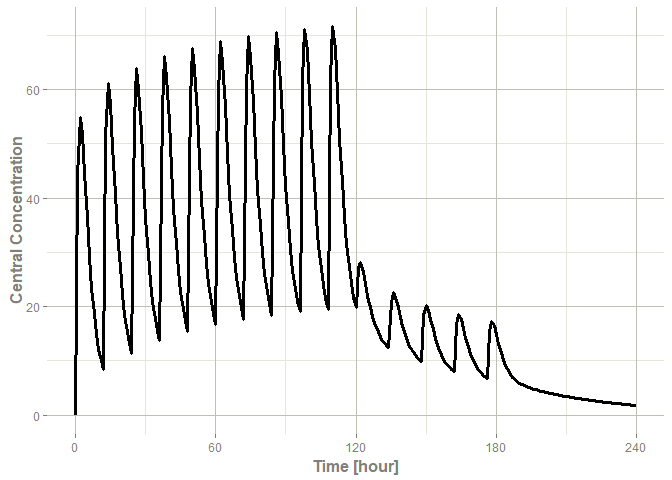

<!--
---
output:
  md_document:
    variant: markdown_github
    toc: true
    toc_depth: 3
---
-->
<!-- README.md is generated from README.Rmd. Please edit that file -->
<!-- https://blog.r-hub.io/2019/12/03/readmes/ -->


# RxODE2

<!-- badges: start -->
[](https://github.com/nlmixr2/rxode2/actions)
[](https://codecov.io/github/nlmixr2/rxode2?branch=master)
[](https://cran.r-project.org/package=rxode2)
[](https://cran.r-project.org/web/checks/check_results_rxode2.html)
[](https://cran.r-project.org/package=rxode2)
[](https://cran.r-project.org/package=rxode2)
[](https://www.codefactor.io/repository/github/nlmixr2/rxode2)
<!-- badges: end -->

## Overview

**rxode2** is an R package for solving and simulating from ode-based
models. These models are convert the rxode2 mini-language to C and
create a compiled dll for fast solving. ODE solving using rxode2 has a
few key parts:

 - `rxode()` which creates the C code for fast ODE solving based on a
   [simple syntax](https://nlmixr2.github.io/rxode2/articles/rxode2-syntax.html) related to Leibnitz notation.
 - The event data, which can be:
   - a `NONMEM` or `deSolve` [compatible data frame](https://nlmixr2.github.io/rxode2/articles/rxode2-event-types.html), or
   - created with `et()` or `EventTable()` for [easy simulation of events](https://nlmixr2.github.io/rxode2/articles/rxode2-event-table.html)
   - The data frame can be augmented by adding
     [time-varying](https://nlmixr2.github.io/rxode2/articles/rxode2-covariates.html#time-varying-covariates)
     or adding [individual covariates](https://nlmixr2.github.io/rxode2/articles/rxode2-covariates.html#individual-covariates) (`iCov=` as needed)
 - `rxSolve()` which solves the system of equations using initial
   conditions and parameters to make predictions
   - With multiple subject data, [this may be
     parallelized](https://nlmixr2.github.io/rxode2/articles/rxode2-speed.html).
   - With single subject the [output data frame is adaptive](https://nlmixr2.github.io/rxode2/articles/rxode2-data-frame.html)
   - Covariances and other metrics of uncertanty can be used to
     [simulate while solving](https://nlmixr2.github.io/rxode2/articles/rxode2-sim-var.html)

## Installation


You can install the released version of rxode2 from
[CRAN](https://CRAN.R-project.org) with:

``` {.r}
install.packages("rxode2")
```

You can install the development version of rxode2 with

``` {.r}
devtools::install_github("nlmixr2/rxode2")
```

To build models with rxode2, you need a working c compiler. To use
parallel threaded solving in rxode2, this c compiler needs to support
open-mp.

You can check to see if R has working c compiler you can check with:

``` {.r}
## install.packages("pkgbuild")
pkgbuild::has_build_tools(debug = TRUE)
```

If you do not have the toolchain, you can set it up as described by the
platform information below:

### Windows

In windows you may simply use installr to install rtools:

``` {.r}
install.packages("installr")
library(installr)
install.rtools()
```

Alternatively you can
[download](https://cran.r-project.org/bin/windows/Rtools/) and install
rtools directly.

### Mac OSX

To get the most speed you need OpenMP enabled and compile rxode2 with
that compiler. There are various options and the most up to date
discussion about this is likely the [data.table installation faq for
MacOS](https://github.com/Rdatatable/data.table/wiki/Installation#openmp-enabled-compiler-for-mac).
The last thing to keep in mind is that `rxode2` uses the code very
similar to the original `lsoda` which requires the `gfortran` compiler
to be setup as well as the `OpenMP` compilers.

If you are going to be using `rxode2` and `nlmixr` together and have an
older mac computer, I would suggest trying the following:

```r
library(symengine)
```

If this crashes your R session then the binary does not work with your
Mac machine.  To be able to run nlmixr, you will need to compile this
package manually.  I will proceed assuming you have `homebrew`
installed on your system.

On your system terminal you will need to install the dependencies to
compile `symengine`:

```sh
brew install cmake gmp mpfr libmpc
```

After installing the dependencies, you need to reinstall `symengine`:

```r
install.packages("symengine", type="source")
library(symengine)
```

### Linux

To install on linux make sure you install `gcc` (with openmp support)
and `gfortran` using your distribution's package manager.

## Development Version

Since the development version of rxode2 uses StanHeaders, you will need
to make sure your compiler is setup to support C++14, as described in
the [rstan setup
page](https://github.com/stan-dev/rstan/wiki/RStan-Getting-Started#configuration-of-the-c-toolchain).
For R 4.0, I do not believe this requires modifying the windows
toolchain any longer (so it is much easier to setup).

Once the C++ toolchain is setup appropriately, you can install the
development version from
[GitHub](https://github.com/nlmixr2/rxode2) with:

``` {.r}
# install.packages("devtools")
devtools::install_github("nlmixr2/rxode2")
```

# Illustrated Example


The model equations can be specified through a text string, a model
file or an R expression. Both differential and algebraic equations are
permitted. Differential equations are specified by `d/dt(var_name) = `. Each
equation can be separated by a semicolon.

To load `rxode2` package and compile the model: 


```r
library(rxode2)

mod1 <- rxode2({
  C2 <- centr/V2;
  C3 <- peri/V3;
  d/dt(depot) <- -KA*depot;
  d/dt(centr) <- KA*depot - CL*C2 - Q*C2 + Q*C3;
  d/dt(peri)  <- Q*C2 - Q*C3;
  d/dt(eff)   <- Kin - Kout*(1-C2/(EC50+C2))*eff;
})
#> 
#> detected new version of rxode2, cleaning cache
#> → creating rxode2 include directory
#> → getting R compile options
#> → precompiling headers
#> ✔ done
#> Warning in file(file, if (append) "a" else "w"): cannot open file '/home/
#> matt/.cache/R/rxode2/rx_0fba07e769d3ed75783fd5f0bf78aba2__.rxd/Makevars': No
#> such file or directory
#> Error in file(file, if (append) "a" else "w"): cannot open the connection
```

## Specify ODE parameters and initial conditions

Model parameters can be defined as named vectors. Names of parameters in
the vector must be a superset of parameters in the ODE model, and the
order of parameters within the vector is not important. 


```r
theta <- 
   c(KA=2.94E-01, CL=1.86E+01, V2=4.02E+01, # central 
     Q=1.05E+01,  V3=2.97E+02,              # peripheral
     Kin=1, Kout=1, EC50=200)               # effects
```

Initial conditions (ICs) can be defined through a vector as well.  If the
elements are not specified, the initial condition for the compartment
is assumed to be zero.


```r
inits <- c(eff=1)
```

If you want to specify the initial conditions in the model you can add:

```
eff(0) = 1
```

## Specify Dosing and sampling in rxode2

`rxode2` provides a simple and very flexible way to specify dosing and
sampling through functions that generate an event table. First, an
empty event table is generated through the "eventTable()" function:


```r
ev <- eventTable(amount.units='mg', time.units='hours')
```

Next, use the `add.dosing()` and `add.sampling()` functions of the
`EventTable` object to specify the dosing (amounts, frequency and/or
times, etc.) and observation times at which to sample the state of the
system.  These functions can be called multiple times to specify more
complex dosing or sampling regiments.  Here, these functions are used
to specify 10mg BID dosing for 5 days, followed by 20mg QD dosing for
5 days:


```r
ev$add.dosing(dose=10000, nbr.doses=10, dosing.interval=12)
ev$add.dosing(dose=20000, nbr.doses=5, start.time=120,
              dosing.interval=24)
ev$add.sampling(0:240)
```

If you wish you can also do this with the `mattigr` pipe operator `%>%`


```r
ev <- eventTable(amount.units="mg", time.units="hours") %>%
  add.dosing(dose=10000, nbr.doses=10, dosing.interval=12) %>%
  add.dosing(dose=20000, nbr.doses=5, start.time=120,
             dosing.interval=24) %>%
  add.sampling(0:240)
```

The functions `get.dosing()` and `get.sampling()` can be used to
retrieve information from the event table.


```r
head(ev$get.dosing())
#>   id low time high       cmt   amt rate ii addl evid ss dur
#> 1  1  NA    0   NA (default) 10000    0 12    9    1  0   0
#> 2  1  NA  120   NA (default) 20000    0 24    4    1  0   0
```


```r
head(ev$get.sampling())
#>   id low time high   cmt amt rate ii addl evid ss dur
#> 1  1  NA    0   NA (obs)  NA   NA NA   NA    0 NA  NA
#> 2  1  NA    1   NA (obs)  NA   NA NA   NA    0 NA  NA
#> 3  1  NA    2   NA (obs)  NA   NA NA   NA    0 NA  NA
#> 4  1  NA    3   NA (obs)  NA   NA NA   NA    0 NA  NA
#> 5  1  NA    4   NA (obs)  NA   NA NA   NA    0 NA  NA
#> 6  1  NA    5   NA (obs)  NA   NA NA   NA    0 NA  NA
```

You may notice that these are similar to NONMEM event tables; If you
are more familiar with NONMEM data and events you could use them
directly with the event table function `et`


```r
ev  <- et(amountUnits="mg", timeUnits="hours") %>%
  et(amt=10000, addl=9,ii=12,cmt="depot") %>%
  et(time=120, amt=2000, addl=4, ii=14, cmt="depot") %>%
  et(0:240) # Add sampling 
```

You can see from the above code, you can dose to the compartment named
in the rxode2 model.  This slight deviation from NONMEM can reduce the
need for compartment renumbering.

These events can also be combined and expanded (to multi-subject
events and complex regimens) with `rbind`, `c`, `seq`, and `rep`. For
more information about creating complex dosing regimens using rxode2
see the [rxode2 events
vignette](https://nlmixr2.github.io/rxode2.doc/articles/rxode2-events.html).


## Solving ODEs

The ODE can now be solved by calling the model object's `run` or `solve`
function. Simulation results for all variables in the model are stored
in the output matrix x. 


```r
x <- mod1$solve(theta, ev, inits);
knitr::kable(head(x))
```


| time|       C2|        C3|     depot|    centr|      peri|      eff|
|----:|--------:|---------:|---------:|--------:|---------:|--------:|
|    0|  0.00000| 0.0000000| 10000.000|    0.000|    0.0000| 1.000000|
|    1| 44.37555| 0.9198298|  7452.765| 1783.897|  273.1895| 1.084664|
|    2| 54.88296| 2.6729825|  5554.370| 2206.295|  793.8758| 1.180825|
|    3| 51.90343| 4.4564927|  4139.542| 2086.518| 1323.5783| 1.228914|
|    4| 44.49738| 5.9807076|  3085.103| 1788.795| 1776.2702| 1.234610|
|    5| 36.48434| 7.1774981|  2299.255| 1466.670| 2131.7169| 1.214742|

You can also solve this and create a rxode2 data frame:


```r
x <- mod1 %>% rxSolve(theta, ev, inits);
x
#> ▂▂▂▂▂▂▂▂▂▂▂▂▂▂▂▂▂▂▂▂▂▂▂▂▂▂▂▂▂▂▂▂▂▂▂▂▂▂▂▂▂▂ Solved rxode2 object ▂▂▂▂▂▂▂▂▂▂▂▂▂▂▂▂▂▂▂▂▂▂▂▂▂▂▂▂▂▂▂▂▂▂▂▂▂▂▂▂▂
#> ── Parameters (x$params): ───────────────────────────────────────────────────────────────────────────────
#>      V2      V3      KA      CL       Q     Kin    Kout    EC50 
#>  40.200 297.000   0.294  18.600  10.500   1.000   1.000 200.000 
#> ── Initial Conditions (x$inits): ────────────────────────────────────────────────────────────────────────
#> depot centr  peri   eff 
#>     0     0     0     1 
#> ── First part of data (object): ─────────────────────────────────────────────────────────────────────────
#> # A tibble: 241 × 7
#>   time    C2    C3  depot centr  peri   eff
#>    [h] <dbl> <dbl>  <dbl> <dbl> <dbl> <dbl>
#> 1    0   0   0     10000     0     0   1   
#> 2    1  44.4 0.920  7453. 1784.  273.  1.08
#> 3    2  54.9 2.67   5554. 2206.  794.  1.18
#> 4    3  51.9 4.46   4140. 2087. 1324.  1.23
#> 5    4  44.5 5.98   3085. 1789. 1776.  1.23
#> 6    5  36.5 7.18   2299. 1467. 2132.  1.21
#> # … with 235 more rows
#> ▂▂▂▂▂▂▂▂▂▂▂▂▂▂▂▂▂▂▂▂▂▂▂▂▂▂▂▂▂▂▂▂▂▂▂▂▂▂▂▂▂▂▂▂▂▂▂▂▂▂▂▂▂▂▂▂▂▂▂▂▂▂▂▂▂▂▂▂▂▂▂▂▂▂▂▂▂▂▂▂▂▂▂▂▂▂▂▂▂▂▂▂▂▂▂▂▂▂▂▂▂▂▂▂▂
```

This returns a modified data frame.  You can see the compartment
values in the plot below:


```r
library(ggplot2)
plot(x,C2) + ylab("Central Concentration")
```



Or, 


```r
plot(x,eff)  + ylab("Effect")
```


Note that the labels are automatically labeled with the units from the
initial event table. rxode2 extracts `units` to label the plot (if they
are present).

# Related R Packages


## ODE solving

This is a brief comparison of pharmacometric ODE solving R packages to
`rxode2`.

There are several [R packages for differential
equations](https://CRAN.R-project.org/view=DifferentialEquations).
The most popular is
[deSolve](https://CRAN.R-project.org/package=deSolve).

However for pharmacometrics-specific ODE solving, there are only 2
packages other than [rxode2](https://cran.r-project.org/package=rxode2)
released on CRAN. Each uses compiled code to have faster ODE solving.

-   [mrgsolve](https://cran.r-project.org/package=mrgsolve), which uses
    C++ lsoda solver to solve ODE systems. The user is required to write
    hybrid R/C++ code to create a mrgsolve model which is translated to
    C++ for solving.

    In contrast, `rxode2` has a R-like mini-language that is parsed into
    C code that solves the ODE system.

    Unlike `rxode2`, `mrgsolve` does not currently support symbolic
    manipulation of ODE systems, like automatic Jacobian calculation or
    forward sensitivity calculation (`rxode2` currently supports this and
    this is the basis of
    [nlmixr2](https://CRAN.R-project.org/package=nlmixr2)'s FOCEi
    algorithm)

-   [dMod](https://CRAN.R-project.org/package=dMod), which uses a unique
    syntax to create "reactions". These reactions create the underlying
    ODEs and then created c code for a compiled deSolve model.

    In contrast `rxode2` defines ODE systems at a lower level. `rxode2`'s
    parsing of the mini-language comes from C, whereas `dMod`'s parsing
    comes from R.

    Like `rxode2`, `dMod` supports symbolic manipulation of ODE systems
    and calculates forward sensitivities and adjoint sensitivities of
    systems.

    Unlike `rxode2`, `dMod` is not thread-safe since `deSolve` is not yet
    thread-safe.

And there is one package that is not released on CRAN:

-   [PKPDsim](https://github.com/InsightRX/PKPDsim) which defines models
    in an R-like syntax and converts the system to compiled code.

    Like `mrgsolve`, `PKPDsim` does not currently support symbolic
    manipulation of ODE systems.

    `PKPDsim` is not thread-safe.

The open pharmacometrics open source community is fairly friendly, and
the rxode2 maintainers has had positive interactions with all of the
ODE-solving pharmacometric projects listed.

## PK Solved systems

`rxode2` supports 1-3 compartment models with gradients (using stan
math's auto-differentiation). This currently uses the same equations as
`PKADVAN` to allow time-varying covariates.

`rxode2` can mix ODEs and solved systems.

### The following packages for solved PK systems are on CRAN

-   [mrgsolve](https://cran.r-project.org/package=mrgsolve) currently
    has 1-2 compartment (poly-exponential models) models built-in. The
    solved systems and ODEs cannot currently be mixed.
-   [pmxTools](https://github.com/kestrel99/pmxTools) currently have 1-3
    compartment (super-positioning) models built-in. This is a R-only
    implementation.
-   [PKPDmodels](https://CRAN.R-project.org/package=PKPDmodels)
    has a one-compartment model with gradients.

### Non-CRAN libraries:

-   [PKADVAN](https://github.com/abuhelwa/PKADVAN_Rpackage) Provides 1-3
    compartment models using non-superpositioning. This allows
    time-varying covariates.
