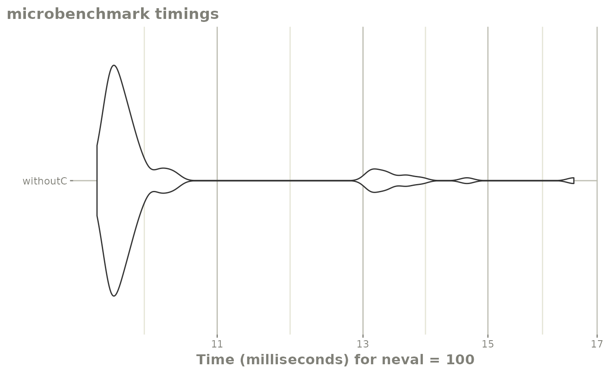

# Integrating User Defined Functions into rxode2

## User Defined Functions

``` r
library(rxode2)
#> rxode2 5.0.0 using 2 threads (see ?getRxThreads)
#>   no cache: create with `rxCreateCache()`
```

When defining models you may have wished to write a small R function or
make a function integrate into `rxode2` somehow. This article discusses
4 ways to do this:

- A R-based user function which can be loaded as a simple function or in
  certain circumstances translated to C to run more efficiently

- A C function that you define and integrate into code

- A user defined function that changes `rxode2` ui code by replacing the
  function with `rxode2` code. This can be in the presence or absence of
  the data for simulation or estimation.

## R based user functions

A R-based user function is the most convenient to include in the ODE,
but is slower than what you could have done if it was written in `C` ,
`C++` or some other compiled language. This was requested [in
github](https://github.com/nlmixrdevelopment/RxODE/issues/162#issue-568886732)
with an appropriate example; However, I will use a very simple example
here to simply illustrate the concepts.

``` r

newAbs <- function(x) {
  if (x < 0) {
    -x
  } else {
    x
  }
}

f <- rxode2({
  a <- newAbs(time)
})

e <- et(-10, 10, length.out=40)
```

Now that the ODE has been compiled the R functions will be called while
solving the ODE. Since this is calling R, this forces the parallization
to be turned off since R is single-threaded. It also takes more time to
solve since it is shuttling back and forth between R and C. Lets see how
this very simple function performs:

``` r
mb1 <- microbenchmark::microbenchmark(withoutC=suppressWarnings(rxSolve(f,e)))

library(ggplot2)
autoplot(mb1) + rxTheme()
#> Warning: `aes_string()` was deprecated in ggplot2 3.0.0.
#> ℹ Please use tidy evaluation idioms with `aes()`.
#> ℹ See also `vignette("ggplot2-in-packages")` for more information.
#> ℹ The deprecated feature was likely used in the microbenchmark package.
#>   Please report the issue at
#>   <https://github.com/joshuaulrich/microbenchmark/issues/>.
#> This warning is displayed once every 8 hours.
#> Call `lifecycle::last_lifecycle_warnings()` to see where this warning was
#> generated.
```



Not terribly bad, even though it is shuffling between R and C.

You can make it a better by converting the functions to C:

``` r
# Create C functions automatically with `rxFun()`
rxFun(newAbs)
#> → finding duplicate expressions in d(newAbs)/d(x)...
#> [====|====|====|====|====|====|====|====|====|====] 0:00:00
#> → optimizing duplicate expressions in d(newAbs)/d(x)...
#> [====|====|====|====|====|====|====|====|====|====] 0:00:00
#> converted R function 'newAbs' to C (will now use in rxode2)
#> converted R function 'rx_newAbs_d_x' to C (will now use in rxode2)
#> Added derivative table for 'newAbs'
# Recompile to use the C functions
# Note it would recompile anyway if you didn't do this step,
# it just makes sure that it doesn't recompile every step in
# the benchmark
f <- rxode2({
  a <- newAbs(time)
})

mb2 <- microbenchmark::microbenchmark(withC=rxSolve(f,e, cores=1))

mb <- rbind(mb1, mb2)
autoplot(mb) + rxTheme() + xgxr::xgx_scale_y_log10()
#> Scale for y is already present.
#> Adding another scale for y, which will replace the existing scale.
```


``` r
print(mb)
#> Unit: milliseconds
#>      expr      min       lq     mean   median       uq       max neval
#>  withoutC 9.242335 9.335623 9.836875 9.383869 9.627086 15.757066   100
#>     withC 3.254436 3.316931 3.780987 3.424131 4.322200  8.283036   100
```

The C version is almost twice as fast as the R version. You may have
noticed the conversion also created C versions of the first derivative.
This is done automatically and gives not just C versions of function,
but C versions of the derivatives and registers them with `rxode2`. This
allows the C versions to work with not only `rxode2` but `nlmixr2`
models.

This function was setup in advance to allow this type of conversion. In
general the derivatives will be calculated if there is not a
[`return()`](https://rdrr.io/r/base/function.html) statement in the user
defined function. This means simply let R return the last value instead
of explictly calling out the
[`return()`](https://rdrr.io/r/base/function.html). Many people prefer
this method of coding.

Even if there is a `return` function, the function could be converted to
`C`. In the github issue, they used a function that would not convert
the derivatives:

``` r
# Light
f_R <- function(actRad, k_0, a_k) {
  photfac <- a_k * actRad + k_0
  if (photfac > 1) {
    photfac = 1
  }
  return(photfac)
}

rxFun(f_R)
#> function contains return statement; derivatives not calculated
#> converted R function 'f_R' to C (will now use in rxode2)
```

While this is still helpful because some functions have early returns,
the `nlmixr2` models requiring derivatives would be calculated be
non-optimized finite differences when this occurs. While this gets into
the internals of `rxode2` and `nlmixr2` you can see this more easily
when calculating the derivatives:

``` r
rxFromSE("Derivative(f_R(actRad, k_0, a_k),k_0)")
#> [1] "(f_R(actRad,(k_0)+6.05545445239334e-06,a_k)-f_R(actRad,k_0,a_k))/6.05545445239334e-06"
```

Whereas the originally defined function `newAbs()` would use the new
derivatives calculated as well:

``` r
rxFromSE("Derivative(newAbs(x),x)")
#> [1] "rx_newAbs_d_x(x)"
```

In some circumstances, the conversion to C is not possible, though you
can still use the R function.

There are some requirements for R functions to be integrated into the
rxode2 system:

- The function must have a set number of arguments, variable arguments
  like `f(…)` are currently not allowed.

- The function is given each argument as a single number, and the
  function should return a single number

If these requirements are met you can use the R function in rxode2.
Additional requirements for conversion to C include:

- Any functions that you use within the R function must be understood
  and available to `rxode2`.

  - Practically speaking if you have `fun2()` which refers to `fun1()`,
    `fun1()` must be changed to C code and available to `rxode2` before
    changing the function `fun2()` to C.

- The functions can include `if`/`else` assignments or simple return
  statements (either by returning a value or having that value on a line
  by itself). Special R control structures and functions (like `for` and
  `lapply`) cannot be present.

- The function cannot refer to any package functions

- As mentioned, if the
  [`return()`](https://rdrr.io/r/base/function.html) statement is
  present, the derivative C functions and `rxode2`’s derivative table is
  not updated.

## C based functions

You can add your own C functions directly into rxode2 as well using
[`rxFun()`](https://nlmixr2.github.io/rxode2/reference/rxFun.md):

``` r
fun <- "
 double fun(double a, double b, double c) {
   return a*a+b*a+c;
 }
" ## C-code for function

rxFun("fun", c("a", "b", "c"), fun)
```

If you wanted you could also use C functions or expressions for the
derivatives by using the
[`rxD()`](https://nlmixr2.github.io/rxode2/reference/rxD.md) function:

``` r
rxD("fun", list(
   function(a, b, c) { # derivative of arg1: a
     paste0("2*", a, "+", b)
   },
   function(a, b, c) { # derivative of arg2: b
     return(a)
   },
   function(a, b, c) { # derivative of arg3: c
     return("0.0")
   }
))
```

Removing the function with
[`rxRmFun()`](https://nlmixr2.github.io/rxode2/reference/rxFun.md) will
also remove the derivative table:

``` r
rxRmFun("fun")
```

## Functions to insert `rxode2` code into the current model

This replaces `rxode2` code in the current model with some expansion.
This can allow more R-like functions inside of the rxode2 ui models, as
well as adding approximating functions like polynomials, splines and
neural networks.

An example that allows more `R`-like functions is below:

``` r
f <- function() {
  model({
    a <- rxpois(lambda=lam)
  })
}

# Which will evaluate into a standard rxode2 function that does not
# support named arguments (since it is translated to C)
f()

# Which is still true in the standard rxode2:

try(rxode2({
  a <- rxpois(lambda=lam)
}))
```

This is accomplished by a combination of two functions, which are highly
commented:

``` r
rxUdfUi.rxpois <- function(fun) {
  # Fun is the language object (ie quoted R object) to be evaluated or
  # changed in the code
  .fun <- fun
  # Since the `rxpois` function is built into the rxode2 we need to
  # have a function with a different conflicts.  In this case, I take
  # the function name (fun[[1]]), and prepend a ".", which follows
  # `rxode2`'s naming convention of un-exported functions.
  #
  # This next evaluation changes the expression function to .rxpois()
  .fun[[1]] <- str2lang(paste0(".", deparse1(fun[[1]])))
  # Since this is still a R expression, you can then evaluate the
  # function .rxpois to produce the proper code:
  eval(.fun)
}

# The above s3 method can be registered in a package or you can use
# the following code to register it in your session:
rxode2::.s3register("rxode2::rxUdfUi", "rxpois")

# This is the function that changes the code as needed
.rxpois <- function(lambda) {
  # The first part of this code tries to change the value into a
  # character.  This handles cases like rxpois(lambda=lam),
  # rxpois(lam), rxpois("lam").  It also tries to evaluate the
  # argument supplied to lambda in case it comes from a different
  # location.
  .lam <- as.character(substitute(lambda))
  .tmp <- try(force(lambda), silent=TRUE)
  if (!inherits(.tmp, "try-error")) {
    if (is.character(.tmp)) {
      .lam <- lambda
    }
  }
  # This part creates a list with the replacement text, in this case
  # it woulb be rxpois(lam) where there is no equals included, as
  # required by `rxode2`:
  list(replace=paste0("rxpois(", .lam, ")"))
}
```

In general the list that the function needs to return can have:

- `$replace` – The text that will be replaced

- `$before` – lines that will be placed in the model before the current
  function is found

- `$after` – lines that are added in the model after the current
  function is found

- `$iniDf` – the initial estimates `data.frame` for this problem. While
  calling this function, you can retrieve the initial conditions
  currently used parsing you can get the prior value with
  [`rxUdfUiIniDf()`](https://nlmixr2.github.io/rxode2/reference/rxUdfUiIniDf.md)
  and then you can modify it inside the function and return the new
  `data.frame` in this list element. This allows you add/delete initial
  estimates from the model as well as modify the model lines themselves.

- `$uiUseData` – when `TRUE`, this instructs `rxode2` and `nlmixr2est`
  to re-parse this function in the presence of data, this means a bit
  more function setup will need to be done.

- `$uiUseMv` – when `TRUE` this instructs `rxode2` to re-parse the
  function after the initial model variables are calculated.

In addition to the
[`rxUdfUiIniDf()`](https://nlmixr2.github.io/rxode2/reference/rxUdfUiIniDf.md)
you can get information about the parser:

- [`rxUdfUiParsing()`](https://nlmixr2.github.io/rxode2/reference/rxUdfUiParsing.md)
  returns if the rxode2 ui function is being parsed currently (this
  allows a function to be overloaded as a `udf` for calling from
  `rxode2` as well as a function for modifying the model).

- [`rxUdfUiNum()`](https://nlmixr2.github.io/rxode2/reference/rxUdfUiNum.md)
  during parsing the function you are calling (in the example above
  [`rxpois()`](https://nlmixr2.github.io/rxode2/reference/rxpois.md) can
  be called multiple times. This gives the number of the function in the
  model in order (the first would give `1` the second, `2`, etc). This
  can be used to create unique variables with functions like
  [`rxIntToLetter()`](https://nlmixr2.github.io/rxode2/reference/rxIntToLetter.md)
  or
  [`rxIntToBase()`](https://nlmixr2.github.io/rxode2/reference/rxIntToBase.md).

- [`rxUdfUiIniLhs()`](https://nlmixr2.github.io/rxode2/reference/rxUdfUiIniLhs.md)
  which gives the left-handed side of the equation where the function is
  found. This is also a `R` language object.

- `rxUdfUiIniMv()` gives the model variables for parsing (can be used in
  functions like `linCmt()`)

- [`rxUdfUiData()`](https://nlmixr2.github.io/rxode2/reference/rxUdfUiData.md)
  which specifies the data that are being used to simulate, estimate,
  etc.

- [`rxUdfUiEst()`](https://nlmixr2.github.io/rxode2/reference/rxUdfUiEst.md)
  which gives the estimation/simulation method that is being used with
  the model. For example, with simulation it would be `rxSolve`.

### Using model variables in `rxode2` ui models

You can also take and change the model and take into consideration the
`rxode2` model variables before the full `ui` has completed its parsing.
These `rxode2` model variables has information that might change what
variables you make or names of variables. For example it has what is on
the left hand side of the equations (`$lhs`), what are the input
parameters (`$params`) and what is the ODE states (`$state`)).

If you are using this approach, you will likely need to do the following
steps:

- When data are not being processed, you need to put the function in an
  `rxode2` acceptable form, no named arguments, no strings, and only
  numbers or variables in the output.

- The number of arguments of this output needs to be declared in the
  `S3` method by adding the attribute `"nargs"` to method. For example,
  the built in `testMod1()` ui modification function uses only one
  argument when parsed

Below is a commented example of the model variables example:

``` r

testMod1 <- function(val=1) {
  # This converts the val to a character if it is somthing like testMod1(b)
  .val <- as.character(substitute(val))
  .tmp <- suppressWarnings(try(force(val), silent = TRUE))
  if (!inherits(.tmp, "try-error")) {
    if (is.character(.tmp)) {
      .val <- val
    }
  }
  # This does the UI parsing
  if (rxUdfUiParsing()) {
    # See if the model variables are available
    .mv <- rxUdfUiMv()
    if (is.null(.mv)) {
      # Put this in a rxode2 low level acceptible form, no complex
      # expressions, no named arguments, something that is suitable
      # for C.
      #
      # The `uiUsMv` tells the parser this needs to be reparsed when
      # the model variables become avaialble during parsing.
      return(list(replace=paste0("testMod1(", .val, ")"),
                  uiUseMv=TRUE))
    } else {
      # Now that we have the model variables, we can then do something
      # about this
      .vars <- .mv$params
      if (length(.vars) > 0) {
        # If there is parameters available, this dummy function times
        # the first input function by the value specified
        return(list(replace=paste0(.vars[1], "*", .val)))
      } else {
        # If the value isn't availble, simply replace the function
        # with the value.
        return(list(replace=.val))
      }
    }
  }
  stop("This function is only for use in rxode2 ui models",
       call.=FALSE)

}

rxUdfUi.testMod1 <- function(fun) {
  eval(fun)
}

# To allow this to go to the next step, you need to declare how many
# arguments this argument has, in this case 1.  Bu adding the
# attribute "nargs", rxode2 lower level parser knows how to handle
# this new function.  This allows rxode2 to generate the model
# variables and send it to the next step.

attr(rxUdfUi.testMod1, "nargs") <- 1L

# If you are in a package, you can use the rxoygen tag @export to
# register this as a rxode2 model definition.
#
# If you are using this in your own script, you need to register the s3 function
# One way to do this is:
rxode2::.s3register("rxode2::rxUdfUi", "testMod1")

## These are some examples of this function in use:

f <- function() {
  model({
    a <- b + testMod1(3)
  })
}

f <- f()

print(f)
#>  ── rxode2-based Pred model ───────────────────────────────────────────────────── 
#>  ── Model (Normalized Syntax): ── 
#> function() {
#>     model({
#>         a <- b + (b * 3)
#>     })
#> }

f <- function() {
  model({
    a <- testMod1(c)
  })
}

f <- f()

print(f)
#>  ── rxode2-based Pred model ───────────────────────────────────────────────────── 
#>  ── Model (Normalized Syntax): ── 
#> function() {
#>     model({
#>         a <- (c * c)
#>     })
#> }

f <- function() {
  model({
    a <- testMod1(1)
  })
}

f <- f()

print(f)
#>  ── rxode2-based Pred model ───────────────────────────────────────────────────── 
#>  ── Model (Normalized Syntax): ── 
#> function() {
#>     model({
#>         a <- 1
#>     })
#> }
```

### Using data for `rxode2` ui modification models

The same steps are needed to use the data in the model replacement; You
can then use the data and the model to replace the values inside the
model. A worked example
[`linMod()`](https://nlmixr2.github.io/rxode2/reference/linMod.md) is
included that has the ability to use:

- model variables,
- put lines before or after the model,
- add initial conditions
- And use data in the initial estimates

``` r

# You can print the code:
linMod
#> function (variable, power, dv = "dv", intercept = TRUE, type = c("replace", 
#>     "before", "after"), num = NULL, iniDf = NULL, data = FALSE, 
#>     mv = FALSE) 
#> {
#>     .dv <- as.character(substitute(dv))
#>     .tmp <- suppressWarnings(try(force(dv), silent = TRUE))
#>     if (!inherits(.tmp, "try-error")) {
#>         if (is.character(.tmp)) {
#>             .dv <- dv
#>         }
#>     }
#>     .var <- as.character(substitute(variable))
#>     .tmp <- try(force(variable), silent = TRUE)
#>     .doExp3 <- FALSE
#>     if (!inherits(.tmp, "try-error")) {
#>         if (is.character(.tmp)) {
#>             .var <- variable
#>         }
#>         else if (!inherits(.tmp, "formula")) {
#>             .dv <- as.character(substitute(dv))
#>             .tmp <- suppressWarnings(try(force(dv), silent = TRUE))
#>             if (!inherits(.tmp, "try-error")) {
#>                 if (is.character(.tmp)) {
#>                   .dv <- dv
#>                 }
#>             }
#>         }
#>         else if (length(variable) == 2) {
#>             if (!identical(variable[[1]], quote(`~`))) {
#>                 stop("unexpected formula, needs to be the form ~x^3", 
#>                   call. = FALSE)
#>             }
#>             .doExp3 <- TRUE
#>             .exp3 <- variable[[2]]
#>         }
#>         else {
#>             if (length(variable) != 3) {
#>                 stop("unexpected formula, needs to be the form dv~x^3", 
#>                   call. = FALSE)
#>             }
#>             if (!identical(variable[[1]], quote(`~`))) {
#>                 stop("unexpected formula, needs to be the form dv~x^3", 
#>                   call. = FALSE)
#>             }
#>             .dv <- as.character(variable[[2]])
#>             data <- TRUE
#>             .exp3 <- variable[[3]]
#>             .doExp3 <- TRUE
#>         }
#>         if (.doExp3) {
#>             if (length(.exp3) == 1) {
#>                 .var <- variable <- as.character(.exp3)
#>                 power <- 1
#>             }
#>             else if (length(.exp3) == 3) {
#>                 if (!identical(.exp3[[1]], quote(`^`))) {
#>                   stop("unexpected formula, needs to be the form dv~x^3", 
#>                     call. = FALSE)
#>                 }
#>                 if (!is.numeric(.exp3[[3]])) {
#>                   stop("unexpected formula, needs to be the form dv~x^3", 
#>                     call. = FALSE)
#>                 }
#>                 .var <- variable <- as.character(.exp3[[2]])
#>                 power <- .exp3[[3]]
#>             }
#>             else {
#>                 stop("unexpected formula, needs to be the form dv~x^3", 
#>                   call. = FALSE)
#>             }
#>         }
#>     }
#>     checkmate::assertCharacter(.var, len = 1L, any.missing = FALSE, 
#>         pattern = "^[.]*[a-zA-Z]+[a-zA-Z0-9._]*$", min.chars = 1L, 
#>         .var.name = "variable")
#>     checkmate::assertCharacter(.dv, len = 1L, any.missing = FALSE, 
#>         pattern = "^[.]*[a-zA-Z]+[a-zA-Z0-9._]*$", min.chars = 1L, 
#>         .var.name = "dv")
#>     checkmate::assertLogical(intercept, len = 1L, any.missing = FALSE)
#>     checkmate::assertIntegerish(power, lower = ifelse(intercept, 
#>         0L, 1L), len = 1L)
#>     if (is.null(num)) {
#>         num <- rxUdfUiNum()
#>     }
#>     checkmate::assertIntegerish(num, lower = 1, any.missing = FALSE, 
#>         len = 1)
#>     if (mv && is.null(rxUdfUiMv())) {
#>         if (intercept) {
#>             return(list(replace = paste0("linModM(", .var, ", ", 
#>                 power, ")"), uiUseMv = TRUE))
#>         }
#>         else {
#>             return(list(replace = paste0("linModM0(", .var, ", ", 
#>                 power, ")"), uiUseMv = TRUE))
#>         }
#>     }
#>     if (data && is.null(rxUdfUiData())) {
#>         if (intercept) {
#>             return(list(replace = paste0("linModD(", .var, ", ", 
#>                 power, ", ", .dv, ")"), uiUseData = TRUE))
#>         }
#>         else {
#>             return(list(replace = paste0("linModD0(", .var, ", ", 
#>                 power, ",", .dv, ")"), uiUseData = TRUE))
#>         }
#>     }
#>     if (is.null(iniDf)) {
#>         iniDf <- rxUdfUiIniDf()
#>     }
#>     assertIniDf(iniDf, null.ok = TRUE)
#>     type <- match.arg(type)
#>     .mv <- rxUdfUiMv()
#>     if (!is.null(.mv)) {
#>         .varsMv <- c(.mv$lhs, .mv$params, .mv$state)
#>         .pre <- paste0(.var, num, rxIntToLetter(seq_len(power + 
#>             ifelse(intercept, 1L, 0L)) - 1L))
#>         .pre <- vapply(.pre, function(v) {
#>             if (v %in% .varsMv) {
#>                 paste0("rx.linMod.", v)
#>             }
#>             else {
#>                 v
#>             }
#>         }, character(1), USE.NAMES = FALSE)
#>     }
#>     else {
#>         .pre <- paste0("rx.linMod.", .var, num, rxIntToLetter(seq_len(power + 
#>             ifelse(intercept, 1L, 0L)) - 1L))
#>     }
#>     if (!is.null(iniDf)) {
#>         .theta <- iniDf[!is.na(iniDf$ntheta), , drop = FALSE]
#>         if (length(.theta$ntheta) > 0L) {
#>             .maxTheta <- max(.theta$ntheta)
#>             .theta1 <- .theta[1, ]
#>         }
#>         else {
#>             .maxTheta <- 0L
#>             .theta1 <- .rxBlankIni("theta")
#>         }
#>         .theta1$lower <- -Inf
#>         .theta1$upper <- Inf
#>         .theta1$fix <- FALSE
#>         .theta1$label <- NA_character_
#>         .theta1$backTransform <- NA_character_
#>         .theta1$condition <- NA_character_
#>         .theta1$err <- NA_character_
#>         .est <- rep(0, length(.pre))
#>         if (data) {
#>             .dat <- rxUdfUiData()
#>             .wdv <- which(tolower(names(.dat)) == tolower(.dv))
#>             if (length(.wdv) == 0L) {
#>                 warning(.dv, "not found in data, so no initial estimates will be set to zero")
#>             }
#>             else {
#>                 names(.dat)[.wdv] <- .dv
#>                 .model <- stats::lm(stats::as.formula(paste0(.dv, 
#>                   " ~ stats::poly(", .var, ",", power, ")", ifelse(intercept, 
#>                     "", "+0"))), data = rxUdfUiData())
#>                 .est <- coef(.model)
#>             }
#>         }
#>         .cur <- c(list(.theta), lapply(seq_along(.pre), function(i) {
#>             .cur <- .theta1
#>             .cur$name <- .pre[i]
#>             .cur$est <- .est[i]
#>             .cur$ntheta <- .maxTheta + i
#>             .cur
#>         }))
#>         .theta <- do.call(rbind, .cur)
#>         .eta <- iniDf[is.na(iniDf$neta), , drop = FALSE]
#>         .iniDf <- rbind(.theta, .eta)
#>     }
#>     else {
#>         .iniDf <- NULL
#>     }
#>     .linMod <- paste(vapply(seq_along(.pre), function(i) {
#>         if (intercept) {
#>             if (i == 1) 
#>                 return(.pre[i])
#>             if (i == 2) 
#>                 return(paste0(.pre[i], "*", .var))
#>             paste0(.pre[i], "*", paste0(.var, "^", i - 1L))
#>         }
#>         else {
#>             if (i == 1) 
#>                 return(paste0(.pre[i], "*", .var))
#>             paste0(.pre[i], "*", paste0(.var, "^", i))
#>         }
#>     }, character(1)), collapse = "+")
#>     if (type == "replace") {
#>         list(replace = .linMod, iniDf = .iniDf)
#>     }
#>     else if (type == "before") {
#>         .replace <- paste0("rx.linMod.", .var, ".f", num)
#>         list(before = paste0(.replace, " <- ", .linMod), replace = .replace, 
#>             iniDf = .iniDf)
#>     }
#>     else if (type == "after") {
#>         .replace <- paste0("rx.linMod.", .var, ".f", num)
#>         list(after = paste0(.replace, " <- ", .linMod), replace = "0", 
#>             iniDf = .iniDf)
#>     }
#> }
#> <bytecode: 0x56486e9b4d28>
#> <environment: namespace:rxode2>

# You can also print the s3 method that is used for this method

rxode2:::rxUdfUi.linMod
#> function (fun) 
#> {
#>     eval(fun)
#> }
#> <bytecode: 0x56486e312a78>
#> <environment: namespace:rxode2>
#> attr(,"nargs")
#> [1] 2
```
