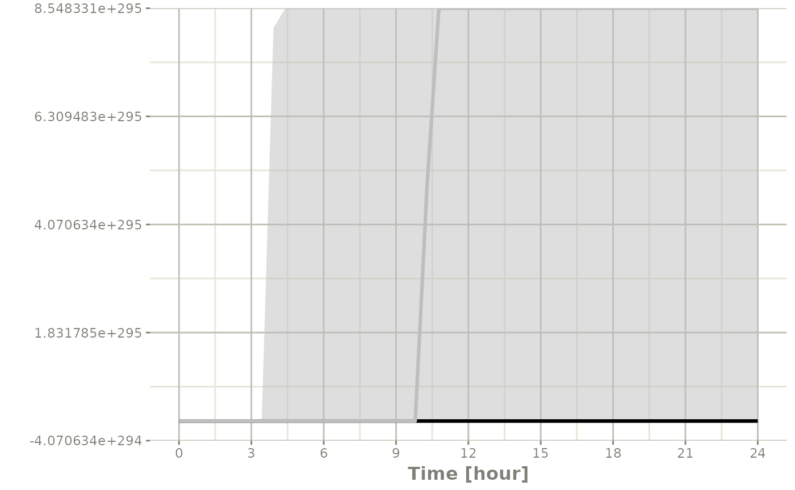

# rxode2 Simulation

## Population Simulations with rxode2

### Simulation of Variability with rxode2

In pharmacometrics the nonlinear-mixed effect modeling software (like
nlmixr) characterizes the between-subject variability. With this between
subject variability you can simulate new subjects.

Assuming that you have a 2-compartment, indirect response model, you can
set create an rxode2 model describing this system below:

#### Setting up the rxode2 model

``` r
library(rxode2)
#> rxode2 5.0.0 using 2 threads (see ?getRxThreads)
#>   no cache: create with `rxCreateCache()`

set.seed(32)
rxSetSeed(32)

mod <- function() {
  ini({
    KA <- 2.94E-01
    TCl <- 1.86E+01
    # between subject variability
    eta.Cl ~ 0.4^2
    V2 <- 4.02E+01
    Q <- 1.05E+01
    V3 <- 2.97E+02
    Kin <- 1
    Kout <- 1
    EC50 <- 200
  })
  model({
    C2 <- centr/V2
    C3 <- peri/V3
    CL <-  TCl*exp(eta.Cl) ## This is coded as a variable in the model
    d/dt(depot) <- -KA*depot
    d/dt(centr) <- KA*depot - CL*C2 - Q*C2 + Q*C3
    d/dt(peri)  <-                    Q*C2 - Q*C3
    d/dt(eff)   <- Kin - Kout*(1-C2/(EC50+C2))*eff
    eff(0) <- 1
  })
}
```

#### Simulating

The next step to simulate is to create the dosing regimen for overall
simulation:

``` r
ev <- et(amountUnits="mg", timeUnits="hours") %>%
  et(amt=10000, cmt="centr")
```

If you wish, you can also add sampling times (though rxode2 can fill
these in for you):

``` r
ev <- ev %>% et(0,48, length.out=100)
```

Note the `et` takes similar arguments as `seq` when adding sampling
times. There are more methods to adding sampling times and events to
make complex dosing regimens (See [the event
vignette](https://nlmixr2.github.io/rxode2/articles/rxode2-events.md)).
This includes ways to add variability to the [both the sampling and
dosing
times](https://nlmixr2.github.io/rxode2/articles/rxode2-events.html#add-doses-and-samples-within-a-sampling-window)).

Once this is complete you can simulate using the `rxSolve` routine:

``` r
sim  <- rxSolve(mod, ev, nSub=100)
#> ℹ parameter labels from comments are typically ignored in non-interactive mode
#> ℹ Need to run with the source intact to parse comments
```

To quickly look and customize your simulation you use the default `plot`
routine. Since this is an rxode2 object, it will create a `ggplot2`
object that you can modify as you wish. The extra parameter to the
`plot` tells `rxode2`/`R` what piece of information you are interested
in plotting. In this case, we are interested in looking at the derived
parameter `C2`:

#### Checking the simulation with `plot`

``` r
library(ggplot2)
## The plots from rxode2 are ggplots so they can be modified with
## standard ggplot commands.
plot(sim, C2, log="y") +
    ylab("Central Compartment")
```


Of course this additional parameter could also be a state value, like
`eff`:

``` r
## They also takes many of the standard plot arguments; See ?plot
plot(sim, eff, ylab="Effect")
```


Or you could even look at the two side-by-side:

``` r
plot(sim, C2, eff)
```


Or stack them with `patchwork`

``` r
library(patchwork)
plot(sim, C2, log="y") / plot(sim, eff)
```


#### Processing the data to create summary plots

Usually in pharmacometric simulations it is not enough to simply
simulate the system. We have to do something easier to digest, like look
at the central and extreme tendencies of the simulation.

Since the `rxode2` solve object is a type of [data
frame](https://nlmixr2.github.io/rxode2/articles/rxode2-data-frame.md)

It is now straightforward to perform calculations and generate plots
with the simulated data. You can

Below, the 5th, 50th, and 95th percentiles of the simulated data are
plotted.

``` r
confint(sim, "C2", level=0.95) %>%
    plot(ylab="Central Concentration", log="y")
#> ! in order to put confidence bands around the intervals, you need at least 2500 simulations
#> summarizing data...done
```


``` r
confint(sim, "eff", level=0.95) %>%
    plot(ylab="Effect")
#> ! in order to put confidence bands around the intervals, you need at least 2500 simulations
#> summarizing data...done
```


Note that you can see the parameters that were simulated for the example

``` r
head(sim$param)
#>   sim.id    KA  TCl   V2    Q  V3 Kin Kout EC50     eta.Cl
#> 1      1 0.294 18.6 40.2 10.5 297   1    1  200  0.8067570
#> 2      2 0.294 18.6 40.2 10.5 297   1    1  200  0.0236961
#> 3      3 0.294 18.6 40.2 10.5 297   1    1  200 -0.3340697
#> 4      4 0.294 18.6 40.2 10.5 297   1    1  200 -0.1098197
#> 5      5 0.294 18.6 40.2 10.5 297   1    1  200 -0.2803752
#> 6      6 0.294 18.6 40.2 10.5 297   1    1  200 -0.2114090
```

#### Simulation of unexplained variability (sigma)

In addition to conveniently simulating between subject variability, you
can also easily simulate unexplained variability.

One way to do that is to create a rxode2 model with the endpoints
defined. Model piping can do this while keeping the model intact:

``` r
mod2 <- mod %>%
  model(eff ~ add(eff.sd), append=TRUE) %>%
  model(C2 ~ prop(prop.sd), append=TRUE) %>%
  ini(eff.sd=sqrt(0.1), prop.sd=sqrt(0.1))
#> ℹ parameter labels from comments are typically ignored in non-interactive mode
#> ℹ Need to run with the source intact to parse comments
#> ℹ add residual parameter `eff.sd` and set estimate to 1
#> ℹ add residual parameter `prop.sd` and set estimate to 1
#> ℹ change initial estimate of `eff.sd` to `0.316227766016838`
#> ℹ change initial estimate of `prop.sd` to `0.316227766016838`
```

You can see how the dataset should be defined with `$multipleEndpoint`:

``` r
mod2$multipleEndpoint
#>   variable                cmt                dvid*
#> 1  eff ~ … cmt='eff' or cmt=4 dvid='eff' or dvid=1
#> 2   C2 ~ …  cmt='C2' or cmt=5  dvid='C2' or dvid=2
```

Here you see the endpoints should be defined for `eff` and `C2`:

``` r
ev <- et(amountUnits="mg", timeUnits="hours") %>%
  et(amt=10000, cmt="centr") %>%
  et(seq(0,48, length.out=100), cmt="eff") %>%
  et(seq(0,48, length.out=100), cmt="C2")
```

Which allows you to solve the system:

``` r
sim  <- rxSolve(mod2, ev, nSub=100)
```

Since this is simulated from a model with the residual specification
included and a multiple endpoint model, you can summarize for each
endpoint by simply taking a confidence interval of `"sim"`:

``` r
s <- confint(sim, "sim")
#> ! in order to put confidence bands around the intervals, you need at least 2500 simulations
#> summarizing data...done

plot(s)
```


If you want to subset to a specific endpoint, like `eff` you can create
the confidence interval for only that endpoint by using the
specification `sim.eff`, where the endpoint name is separated from `sim`
by a dot:

``` r
seff <- confint(sim, "sim.eff")
#> ! in order to put confidence bands around the intervals, you need at least 2500 simulations
#> summarizing data...done

plot(seff)
```


#### Simulation of Individuals

Sometimes you may want to match the dosing and observations of
individuals in a clinical trial. To do this you will have to create a
data.frame using the `rxode2` event specification as well as an `ID`
column to indicate an individual. The rxode2 event vignette talks more
about how these datasets should be created.

``` r
library(dplyr)
#> 
#> Attaching package: 'dplyr'
#> The following objects are masked from 'package:stats':
#> 
#>     filter, lag
#> The following objects are masked from 'package:base':
#> 
#>     intersect, setdiff, setequal, union
ev1 <- et(amountUnits="mg", timeUnits="hours") %>%
    et(amt=10000, cmt=2) %>%
    et(0,48,length.out=10)

ev2 <- et(amountUnits="mg", timeUnits="hours") %>%
    et(amt=5000, cmt=2) %>%
    et(0,48,length.out=8)

dat <- rbind(data.frame(ID=1, ev1$get.EventTable()),
             data.frame(ID=2, ev2$get.EventTable()))


## Note the number of subject is not needed since it is determined by the data
sim  <- rxSolve(mod, dat)
#> ℹ parameter labels from comments are typically ignored in non-interactive mode
#> ℹ Need to run with the source intact to parse comments

sim %>% select(id, time, eff, C2)
#>    id          time      eff          C2
#> 1   1  0.000000 [h] 1.000000 248.7562189
#> 2   1  5.333333 [h] 1.062982   5.3970840
#> 3   1 10.666667 [h] 1.013881   2.5901710
#> 4   1 16.000000 [h] 1.011565   2.2550581
#> 5   1 21.333333 [h] 1.010158   1.9820213
#> 6   1 26.666667 [h] 1.008929   1.7422286
#> 7   1 32.000000 [h] 1.007849   1.5314615
#> 8   1 37.333333 [h] 1.006899   1.3461870
#> 9   1 42.666667 [h] 1.006064   1.1833253
#> 10  1 48.000000 [h] 1.005330   1.0401683
#> 11  2  0.000000 [h] 1.000000 124.3781095
#> 12  2  6.857143 [h] 1.005764   0.7047232
#> 13  2 13.714286 [h] 1.002879   0.5592808
#> 14  2 20.571429 [h] 1.002381   0.4630160
#> 15  2 27.428571 [h] 1.001971   0.3833262
#> 16  2 34.285714 [h] 1.001632   0.3173516
#> 17  2 41.142857 [h] 1.001351   0.2627315
#> 18  2 48.000000 [h] 1.001118   0.2175123
```

## Simulation of Clinical Trials

By either using a simple single event table, or data from a clinical
trial as described above, a complete clinical trial simulation can be
performed.

Typically in clinical trial simulations you want to account for the
uncertainty in the fixed parameter estimates, and even the uncertainty
in both your between subject variability as well as the unexplained
variability.

`rxode2` allows you to account for these uncertainties by simulating
multiple virtual “studies,” specified by the parameter `nStud`. Each of
these studies samples a realization of fixed effect parameters and
covariance matrices for the between subject variability(`omega`) and
unexplained variabilities (`sigma`). Depending on the information you
have from the models, there are a few strategies for simulating a
realization of the `omega` and `sigma` matrices.

The first strategy occurs when either there is not any standard errors
for standard deviations (or related parameters), or there is a modeled
correlation in the model you are simulating from. In that case the
suggested strategy is to use the inverse Wishart (parameterized to scale
to the conjugate prior)/[scaled inverse chi
distribution](https://en.wikipedia.org/wiki/Scaled_inverse_chi-squared_distribution).
this approach uses a single parameter to inform the variability of the
covariance matrix sampled (the degrees of freedom).

The second strategy occurs if you have standard errors on the
variance/standard deviation with no modeled correlations in the
covariance matrix. In this approach you perform separate simulations for
the standard deviations and the correlation matrix. First you simulate
the variance/standard deviation components in the `thetaMat`
multivariate normal simulation. After simulation and transformation to
standard deviations, a correlation matrix is simulated using the degrees
of freedom of your covariance matrix. Combining the simulated standard
deviation with the simulated correlation matrix will give a simulated
covariance matrix. For smaller dimension covariance matrices (dimension
\< 10x10) it is recommended you use the `lkj` distribution to simulate
the correlation matrix. For higher dimension covariance matrices it is
suggested you use the inverse wishart distribution (transformed to a
correlation matrix) for the simulations.

The covariance/variance prior is simulated from `rxode2`s
[`cvPost()`](https://nlmixr2.github.io/rxode2/reference/cvPost.md)
function.

### Simulation from inverse Wishart correlations

An example of this simulation is below:

``` r

## Creating covariance matrix
tmp <- matrix(rnorm(8^2), 8, 8)
tMat <- tcrossprod(tmp, tmp) / (8 ^ 2)
dimnames(tMat) <- list(NULL, names(mod2$theta)[1:8])

sim  <- rxSolve(mod2, ev, nSub=100, thetaMat=tMat, nStud=10,
                dfSub=10, dfObs=100)

s <-sim %>% confint("sim")
#> ! in order to put confidence bands around the intervals, you need at least 2500 simulations
#> summarizing data...done

plot(s)
```


If you wish you can see what `omega` and `sigma` was used for each
virtual study by accessing them in the solved data object with
`$omega.list` and `$sigma.list`:

``` r
head(sim$omegaList)
#> [[1]]
#>           eta.Cl
#> eta.Cl 0.1676778
#> 
#> [[2]]
#>           eta.Cl
#> eta.Cl 0.2917085
#> 
#> [[3]]
#>           eta.Cl
#> eta.Cl 0.1776813
#> 
#> [[4]]
#>           eta.Cl
#> eta.Cl 0.1578682
#> 
#> [[5]]
#>           eta.Cl
#> eta.Cl 0.1845614
#> 
#> [[6]]
#>           eta.Cl
#> eta.Cl 0.3282268
```

``` r
head(sim$sigmaList)
#> [[1]]
#>            rxerr.eff   rxerr.C2
#> rxerr.eff 1.12416983 0.04197039
#> rxerr.C2  0.04197039 0.97293971
#> 
#> [[2]]
#>             rxerr.eff    rxerr.C2
#> rxerr.eff  0.84311199 -0.06277998
#> rxerr.C2  -0.06277998  1.22140938
#> 
#> [[3]]
#>           rxerr.eff  rxerr.C2
#> rxerr.eff 0.9834771 0.1060251
#> rxerr.C2  0.1060251 1.0024751
#> 
#> [[4]]
#>            rxerr.eff   rxerr.C2
#> rxerr.eff 1.25556975 0.07690868
#> rxerr.C2  0.07690868 0.90991261
#> 
#> [[5]]
#>           rxerr.eff  rxerr.C2
#> rxerr.eff  1.116261 -0.184748
#> rxerr.C2  -0.184748  1.320288
#> 
#> [[6]]
#>            rxerr.eff   rxerr.C2
#> rxerr.eff 0.93539238 0.07270049
#> rxerr.C2  0.07270049 0.98648424
```

You can also see the parameter realizations from the `$params` data
frame.

### Simulate using covariance inputs

Lets assume we wish to simulate from [the nonmem run included in
xpose](https://github.com/UUPharmacometrics/xpose/blob/master/inst/extdata/run001.lst)

First we setup the model; Since we are taking this from nonmem and would
like to use the more free-form style from the classic `rxode2` model we
start from the classic model:

``` r
rx1 <- rxode2({
  cl <- tcl*(1+crcl.cl*(CLCR-65)) * exp(eta.cl)
  v <- tv * WT * exp(eta.v)
  ka <- tka * exp(eta.ka)
  ipred <- linCmt()
  obs <- ipred * (1 + prop.sd) + add.sd
})
```

Next we input the estimated parameters:

``` r
theta <- c(tcl=2.63E+01, tv=1.35E+00, tka=4.20E+00, tlag=2.08E-01,
           prop.sd=2.05E-01, add.sd=1.06E-02, crcl.cl=7.17E-03,
           ## Note that since we are using the separation strategy the ETA variances are here too
           eta.cl=7.30E-02,  eta.v=3.80E-02, eta.ka=1.91E+00)
```

And also their covariances; To me, the easiest way to create a named
covariance matrix is to use
[`lotri()`](https://nlmixr2.github.io/lotri/reference/lotri.html):

``` r
thetaMat <- lotri(
    tcl + tv + tka + tlag + prop.sd + add.sd + crcl.cl + eta.cl + eta.v + eta.ka ~
        c(7.95E-01,
          2.05E-02, 1.92E-03,
          7.22E-02, -8.30E-03, 6.55E-01,
          -3.45E-03, -6.42E-05, 3.22E-03, 2.47E-04,
          8.71E-04, 2.53E-04, -4.71E-03, -5.79E-05, 5.04E-04,
          6.30E-04, -3.17E-06, -6.52E-04, -1.53E-05, -3.14E-05, 1.34E-05,
          -3.30E-04, 5.46E-06, -3.15E-04, 2.46E-06, 3.15E-06, -1.58E-06, 2.88E-06,
          -1.29E-03, -7.97E-05, 1.68E-03, -2.75E-05, -8.26E-05, 1.13E-05, -1.66E-06, 1.58E-04,
          -1.23E-03, -1.27E-05, -1.33E-03, -1.47E-05, -1.03E-04, 1.02E-05, 1.67E-06, 6.68E-05, 1.56E-04,
          7.69E-02, -7.23E-03, 3.74E-01, 1.79E-03, -2.85E-03, 1.18E-05, -2.54E-04, 1.61E-03, -9.03E-04, 3.12E-01))

evw <- et(amount.units="mg", time.units="hours") %>%
    et(amt=100) %>%
    ## For this problem we will simulate with sampling windows
    et(list(c(0, 0.5),
       c(0.5, 1),
       c(1, 3),
       c(3, 6),
       c(6, 12))) %>%
    et(id=1:1000)

## From the run we know that:
##   total number of observations is: 476
##    Total number of individuals:     74
sim  <- rxSolve(rx1, theta, evw,  nSub=100, nStud=10,
                thetaMat=thetaMat,
                ## Match boundaries of problem
                thetaLower=0,
                sigma=c("prop.sd", "add.sd"), ## Sigmas are standard deviations
                sigmaXform="identity", # default sigma xform="identity"
                omega=c("eta.cl", "eta.v", "eta.ka"), ## etas are variances
                omegaXform="variance", # default omega xform="variance"
                iCov=data.frame(WT=rnorm(1000, 70, 15), CLCR=rnorm(1000, 65, 25)),
                dfSub=74, dfObs=476);
#> ℹ thetaMat has too many items, ignored: 'tlag'
#> [====|====|====|====|====|====|====|====|====|====] 0:00:00

print(sim)
#> ── Solved rxode2 object ──
#> ── Parameters ($params): ──
#> # A tibble: 10,000 × 9
#>    sim.id id      tcl crcl.cl  eta.cl    tv    eta.v   tka eta.ka
#>     <int> <fct> <dbl>   <dbl>   <dbl> <dbl>    <dbl> <dbl>  <dbl>
#>  1      1 1      27.0   0.995  0.489   1.45  0.975    4.51 -0.186
#>  2      1 2      27.0   0.995 -0.770   1.45  0.0294   4.51 -0.116
#>  3      1 3      27.0   0.995 -2.13    1.45  0.187    4.51  0.941
#>  4      1 4      27.0   0.995  0.333   1.45 -0.346    4.51 -0.686
#>  5      1 5      27.0   0.995  1.01    1.45  0.978    4.51  1.69 
#>  6      1 6      27.0   0.995 -0.474   1.45  1.06     4.51 -0.641
#>  7      1 7      27.0   0.995 -0.0488  1.45  1.18     4.51  0.395
#>  8      1 8      27.0   0.995  0.267   1.45  0.164    4.51  1.41 
#>  9      1 9      27.0   0.995 -1.19    1.45  1.24     4.51 -0.726
#> 10      1 10     27.0   0.995 -0.163   1.45 -0.00741  4.51 -0.799
#> # ℹ 9,990 more rows
#> ── Initial Conditions ($inits): ──
#>   depot central 
#>       0       0 
#> 
#> Simulation with uncertainty in:
#> • parameters ($thetaMat for changes)
#> • omega matrix ($omegaList)
#> • sigma matrix ($sigmaList)
#> 
#> ── First part of data (object): ──
#> # A tibble: 50,000 × 12
#>   sim.id    id   time    cl     v    ka   ipred    obs   depot central    WT
#>    <int> <int>    [h] <dbl> <dbl> <dbl>   <dbl>  <dbl>   <dbl>   <dbl> <dbl>
#> 1      1     1 0.151   230. 240.   3.74 0.167   1.21   5.68e+1  39.9    62.2
#> 2      1     1 0.568   230. 240.   3.74 0.258   0.700  1.19e+1  61.9    62.2
#> 3      1     1 1.02    230. 240.   3.74 0.198   0.0443 2.18e+0  47.5    62.2
#> 4      1     1 4.49    230. 240.   3.74 0.00753 0.261  5.01e-6   1.80   62.2
#> 5      1     1 6.19    230. 240.   3.74 0.00148 1.21   8.84e-9   0.355  62.2
#> 6      1     2 0.0833  515.  53.3  4.01 0.358   0.620  7.16e+1  19.1    35.7
#> # ℹ 49,994 more rows
#> # ℹ 1 more variable: CLCR <dbl>
## Notice that the simulation time-points change for the individual

## If you want the same sampling time-points you can do that as well:
evw <- et(amount.units="mg", time.units="hours") %>%
    et(amt=100) %>%
    et(0, 24, length.out=50) %>%
    et(id=1:100)

sim  <- rxSolve(rx1, theta, evw,  nSub=100, nStud=10,
                thetaMat=thetaMat,
                ## Match boundaries of problem
                thetaLower=0,
                sigma=c("prop.sd", "add.sd"), ## Sigmas are standard deviations
                sigmaXform="identity", # default sigma xform="identity"
                omega=c("eta.cl", "eta.v", "eta.ka"), ## etas are variances
                omegaXform="variance", # default omega xform="variance"
                iCov=data.frame(WT=rnorm(100, 70, 15), CLCR=rnorm(100, 65, 25)),
                dfSub=74, dfObs=476,
                resample=TRUE)
#> ℹ thetaMat has too many items, ignored: 'tlag'

s <-sim %>% confint(c("ipred"))
#> summarizing data...
#> done
plot(s)
#> Warning: `aes_string()` was deprecated in ggplot2 3.0.0.
#> ℹ Please use tidy evaluation idioms with `aes()`.
#> ℹ See also `vignette("ggplot2-in-packages")` for more information.
#> ℹ The deprecated feature was likely used in the rxode2 package.
#>   Please report the issue at <https://github.com/nlmixr2/rxode2/issues/>.
#> This warning is displayed once every 8 hours.
#> Call `lifecycle::last_lifecycle_warnings()` to see where this warning was
#> generated.
```



### Simulate without uncertainty in `omega` or `sigma` parameters

If you do not wish to sample from the prior distributions of either the
`omega` or `sigma` matrices, you can turn off this feature by specifying
the `simVariability = FALSE` option when solving:

``` r

sim  <- rxSolve(mod2, ev, nSub=100, thetaMat=tMat, nStud=10,
                simVariability=FALSE)

s <-sim %>% confint(c("centr", "eff"))
#> ! in order to put confidence bands around the intervals, you need at least 2500 simulations
#> summarizing data...done

plot(s)
```


Note since realizations of `omega` and `sigma` were not simulated,
`$omegaList` and `$sigmaList` both return `NULL`.
