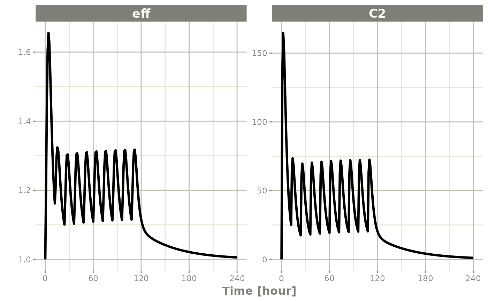
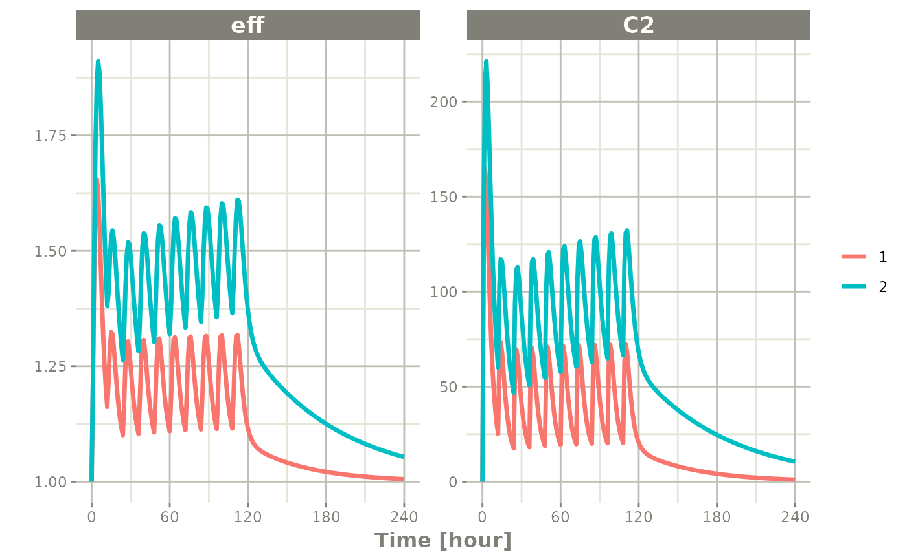

# Single Subject ODE solving -- differences from multiple subject

## Single Subject solving

Originally, rxode2 was only created to solve ODEs for one individual.
That is a single system without any changes in individual parameters.

Of course this is still supported, the classic examples are found in
[rxode2
intro](https://nlmixr2.github.io/rxode2/articles/rxode2-intro.html).

This article discusses the differences between multiple subject and
single subject solving. There are three differences:

- Single solving does not solve each ID in parallel
- Single solving lacks the `id` column in parameters(`$params`) as well
  as in the actual dataset.
- Single solving allows parameter exploration easier because each
  parameter can be modified. With multiple subject solves, you have to
  make sure to update each individual parameter.

The first obvious difference is in speed; With multiple subjects you can
run each subject ID in parallel. For more information and examples of
the speed gains with multiple subject solving see the [Speeding up
rxode2](https://nlmixr2.github.io/rxode2/articles/rxode2-speed.md)
vignette.

The next difference is the amount of information output in the final
data.

Taking the 2 compartment indirect response model originally in the
tutorial:

``` r
library(rxode2)
#> rxode2 5.0.0 using 2 threads (see ?getRxThreads)
#>   no cache: create with `rxCreateCache()`

mod1 <- function() {
  ini({
    KA=2.94E-01
    CL=1.86E+01
    V2=4.02E+01
    Q=1.05E+01
    V3=2.97E+02
    Kin=1
    Kout=1
    EC50=200
  })
  model({
    C2 = centr/V2
    C3 = peri/V3
    d/dt(depot) =-KA*depot
    d/dt(centr) = KA*depot - CL*C2 - Q*C2 + Q*C3
    d/dt(peri)  =                    Q*C2 - Q*C3
    d/dt(eff)  = Kin - Kout*(1-C2/(EC50+C2))*eff
    eff(0) = 1
  })
}
  
et <- et(amount.units='mg', time.units='hours') %>%
    et(dose=10000, addl=9, ii=12) %>%
    et(amt=20000, nbr.doses=5, start.time=120, dosing.interval=24) %>%
    et(0:240) # sampling
```

Now a simple solve

``` r
x <- rxSolve(mod1, et)
#> ℹ parameter labels from comments are typically ignored in non-interactive mode
#> ℹ Need to run with the source intact to parse comments
x
#> ── Solved rxode2 object ──
#> ── Parameters (x$params): ──
#>      KA      CL      V2       Q      V3     Kin    Kout    EC50 
#>   0.294  18.600  40.200  10.500 297.000   1.000   1.000 200.000 
#> ── Initial Conditions (x$inits): ──
#> depot centr  peri   eff 
#>     0     0     0     1 
#> ── First part of data (object): ──
#> # A tibble: 241 × 7
#>   time    C2    C3  depot centr  peri   eff
#>    [h] <dbl> <dbl>  <dbl> <dbl> <dbl> <dbl>
#> 1    0   0   0     10000     0     0   1   
#> 2    1  44.4 0.920  7453. 1784.  273.  1.08
#> 3    2  54.9 2.67   5554. 2206.  794.  1.18
#> 4    3  51.9 4.46   4140. 2087. 1324.  1.23
#> 5    4  44.5 5.98   3085. 1789. 1776.  1.23
#> 6    5  36.5 7.18   2299. 1467. 2132.  1.21
#> # ℹ 235 more rows

print(x)
#> ── Solved rxode2 object ──
#> ── Parameters ($params): ──
#>      KA      CL      V2       Q      V3     Kin    Kout    EC50 
#>   0.294  18.600  40.200  10.500 297.000   1.000   1.000 200.000 
#> ── Initial Conditions ($inits): ──
#> depot centr  peri   eff 
#>     0     0     0     1 
#> ── First part of data (object): ──
#> # A tibble: 241 × 7
#>   time    C2    C3  depot centr  peri   eff
#>    [h] <dbl> <dbl>  <dbl> <dbl> <dbl> <dbl>
#> 1    0   0   0     10000     0     0   1   
#> 2    1  44.4 0.920  7453. 1784.  273.  1.08
#> 3    2  54.9 2.67   5554. 2206.  794.  1.18
#> 4    3  51.9 4.46   4140. 2087. 1324.  1.23
#> 5    4  44.5 5.98   3085. 1789. 1776.  1.23
#> 6    5  36.5 7.18   2299. 1467. 2132.  1.21
#> # ℹ 235 more rows

plot(x, C2, eff)
```



To better see the differences between the single solve, you can solve
for 2 individuals

``` r
x2 <- rxSolve(mod1, et %>% et(id=1:2), params=data.frame(CL=c(18.6, 7.6)))
#> ℹ parameter labels from comments are typically ignored in non-interactive mode
#> ℹ Need to run with the source intact to parse comments
print(x2)
#> ── Solved rxode2 object ──
#> ── Parameters ($params): ──
#> # A tibble: 2 × 9
#>   id       KA    CL    V2     Q    V3   Kin  Kout  EC50
#>   <fct> <dbl> <dbl> <dbl> <dbl> <dbl> <dbl> <dbl> <dbl>
#> 1 1     0.294  18.6  40.2  10.5   297     1     1   200
#> 2 2     0.294   7.6  40.2  10.5   297     1     1   200
#> ── Initial Conditions ($inits): ──
#> depot centr  peri   eff 
#>     0     0     0     1 
#> ── First part of data (object): ──
#> # A tibble: 482 × 8
#>      id time    C2    C3  depot centr  peri   eff
#>   <int>  [h] <dbl> <dbl>  <dbl> <dbl> <dbl> <dbl>
#> 1     1    0   0   0     10000     0     0   1   
#> 2     1    1  44.4 0.920  7453. 1784.  273.  1.08
#> 3     1    2  54.9 2.67   5554. 2206.  794.  1.18
#> 4     1    3  51.9 4.46   4140. 2087. 1324.  1.23
#> 5     1    4  44.5 5.98   3085. 1789. 1776.  1.23
#> 6     1    5  36.5 7.18   2299. 1467. 2132.  1.21
#> # ℹ 476 more rows

plot(x2, C2, eff)
```



By observing the two solves, you can see:

- A multiple subject solve contains the `id` column both in the data
  frame and then data frame of parameters for each subject.

The last feature that is not as obvious, modifying the individual
parameters. For single subject data, you can modify the rxode2 data
frame changing initial conditions and parameter values as if they were
part of the data frame, as described in the [rxode2 Data
Frames](https://nlmixr2.github.io/rxode2/articles/rxode2-data-frame.html).

For multiple subject solving, this feature still works, but requires
care when supplying each individual’s parameter value, otherwise you may
change the solve and drop parameter for key individuals.

### Summary of Single solve vs Multiple subject solving

| Feature     | Single Subject Solve                            | Multiple Subject Solve                                    |
|-------------|-------------------------------------------------|-----------------------------------------------------------|
| Parallel    | None                                            | Each Subject                                              |
| \$params    | data.frame with one parameter value             | data.frame with one parameter per subject (w/ID column)   |
| solved data | Can modify individual parameters with \$ syntax | Have to modify all the parameters to update solved object |
