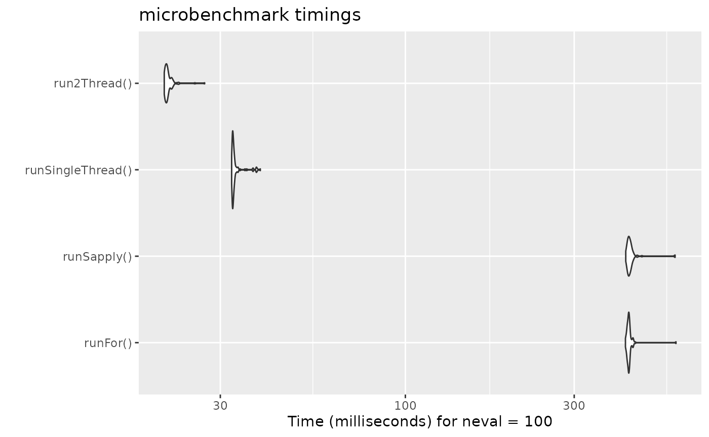

# Speeding up rxode2

## A note about the speed of the functional form for rxode2

The functional form has the benefit that it is what is supported by
nlmixr2 and therefore there is only one interface between solving and
estimating, and it takes some computation time to get to the underlying
“classic” simulation code.

These models are in the form of:

``` r
library(rxode2)
#> rxode2 5.0.0 using 2 threads (see ?getRxThreads)
#>   no cache: create with `rxCreateCache()`

mod1 <- function() {
  ini({
    KA   <- 0.3
    CL   <- 7
    V2   <- 40
    Q    <- 10
    V3   <- 300
    Kin  <- 0.2
    Kout <- 0.2
    EC50 <- 8
  })
  model({
    C2 = centr/V2
    C3 = peri/V3
    d/dt(depot) = -KA*depot
    d/dt(centr) = KA*depot - CL*C2 - Q*C2 + Q*C3
    d/dt(peri) = Q*C2 - Q*C3
    d/dt(eff) = Kin - Kout*(1-C2/(EC50+C2))*eff
    eff(0) = 1
  })
}
```

Or you can also specify the end-points for simulation/estimation just
like `nlmixr2`:

``` r
mod2f <- function() {
  ini({
    TKA   <- 0.3
    TCL   <- 7
    TV2   <- 40
    TQ    <- 10
    TV3   <- 300
    TKin  <- 0.2
    TKout <- 0.2
    TEC50 <- 8
    eta.cl + eta.v ~ c(0.09,
                       0.08, 0.25)
    c2.prop.sd <- 0.1
    eff.add.sd <- 0.1
  })
  model({
    KA <- TKA
    CL <- TCL*exp(eta.cl)
    V2  <- TV2*exp(eta.v)
    Q   <- TQ
    V3  <- TV3
    Kin  <- TKin
    Kout <- TKout
    EC50 <- TEC50
    C2 = centr/V2
    C3 = peri/V3
    d/dt(depot) = -KA*depot
    d/dt(centr) = KA*depot - CL*C2 - Q*C2 + Q*C3
    d/dt(peri) = Q*C2 - Q*C3
    d/dt(eff) = Kin - Kout*(1-C2/(EC50+C2))*eff
    eff(0) = 1
    C2 ~ prop(c2.prop.sd)
    eff ~ add(eff.add.sd)
  })
}
```

For every solve, there is a compile (or a cached compile) of the
underlying model. If you wish to speed this process up you can use the
two underlying `rxode2` classic models. This takes two steps:

- Parsing/evaluating the model

- Creating the simulation model

The first step can be done by `rxode2(mod1)` or `mod1()` (or for the
second model too).

``` r
mod1 <- mod1()
mod2f <- rxode2(mod2f)
#> ℹ parameter labels from comments are typically ignored in non-interactive mode
#> ℹ Need to run with the source intact to parse comments
```

The second step is to create the underlying “classic” `rxode2` model,
which can be done with two different methods:`$simulationModel` and
`$simulationIniModel`. The `$simulationModel` will provide the
simulation code without the initial conditions pre-pended, the
`$simulationIniModel` will pre-pend the values. When the endpoints are
specified, the simulation code for each endpoint is also output. You can
see the differences below:

``` r
summary(mod1$simulationModel)
#> rxode2 5.0.0 model named rx_4bb29568be7917afb0485c0d0363ff9a model (✔ ready). 
#> DLL: /tmp/Rtmp0IWJei/rxode2/rx_4bb29568be7917afb0485c0d0363ff9a__.rxd/rx_4bb29568be7917afb0485c0d0363ff9a_.so
#> NULL
#> 
#> Calculated Variables:
#> [1] "C2" "C3"
#> ── rxode2 Model Syntax ──
#> rxode2({
#>     param(KA, CL, V2, Q, V3, Kin, Kout, EC50)
#>     C2 = centr/V2
#>     C3 = peri/V3
#>     d/dt(depot) = -KA * depot
#>     d/dt(centr) = KA * depot - CL * C2 - Q * C2 + Q * C3
#>     d/dt(peri) = Q * C2 - Q * C3
#>     d/dt(eff) = Kin - Kout * (1 - C2/(EC50 + C2)) * eff
#>     eff(0) = 1
#> })
summary(mod1$simulationIniModel)
#> rxode2 5.0.0 model named rx_b18dc701884b2b853e652d3c1ed7ad27 model (✔ ready). 
#> DLL: /tmp/Rtmp0IWJei/rxode2/rx_b18dc701884b2b853e652d3c1ed7ad27__.rxd/rx_b18dc701884b2b853e652d3c1ed7ad27_.so
#> NULL
#> 
#> Calculated Variables:
#> [1] "C2" "C3"
#> ── rxode2 Model Syntax ──
#> rxode2({
#>     param(KA, CL, V2, Q, V3, Kin, Kout, EC50)
#>     KA = 0.3
#>     CL = 7
#>     V2 = 40
#>     Q = 10
#>     V3 = 300
#>     Kin = 0.2
#>     Kout = 0.2
#>     EC50 = 8
#>     C2 = centr/V2
#>     C3 = peri/V3
#>     d/dt(depot) = -KA * depot
#>     d/dt(centr) = KA * depot - CL * C2 - Q * C2 + Q * C3
#>     d/dt(peri) = Q * C2 - Q * C3
#>     d/dt(eff) = Kin - Kout * (1 - C2/(EC50 + C2)) * eff
#>     eff(0) = 1
#> })
summary(mod2f$simulationModel)
#> rxode2 5.0.0 model named rx_0a47c1457aac29fea656bf49fde56fc3 model (✔ ready). 
#> DLL: /tmp/Rtmp0IWJei/rxode2/rx_0a47c1457aac29fea656bf49fde56fc3__.rxd/rx_0a47c1457aac29fea656bf49fde56fc3_.so
#> NULL
#> 
#> Calculated Variables:
#>  [1] "KA"       "CL"       "V2"       "Q"        "V3"       "Kin"     
#>  [7] "Kout"     "EC50"     "C2"       "C3"       "ipredSim" "sim"     
#> ── rxode2 Model Syntax ──
#> rxode2({
#>     param(TKA, TCL, TV2, TQ, TV3, TKin, TKout, TEC50, c2.prop.sd, 
#>         eff.add.sd, eta.cl, eta.v)
#>     KA = TKA
#>     CL = TCL * exp(eta.cl)
#>     V2 = TV2 * exp(eta.v)
#>     Q = TQ
#>     V3 = TV3
#>     Kin = TKin
#>     Kout = TKout
#>     EC50 = TEC50
#>     C2 = centr/V2
#>     C3 = peri/V3
#>     d/dt(depot) = -KA * depot
#>     d/dt(centr) = KA * depot - CL * C2 - Q * C2 + Q * C3
#>     d/dt(peri) = Q * C2 - Q * C3
#>     d/dt(eff) = Kin - Kout * (1 - C2/(EC50 + C2)) * eff
#>     eff(0) = 1
#>     if (CMT == 5) {
#>         rx_yj_ ~ 2
#>         rx_lambda_ ~ 1
#>         rx_low_ ~ 0
#>         rx_hi_ ~ 1
#>         rx_pred_f_ ~ C2
#>         rx_pred_ ~ rx_pred_f_
#>         rx_r_ ~ (rx_pred_f_ * c2.prop.sd)^2
#>         ipredSim = rxTBSi(rx_pred_, rx_lambda_, rx_yj_, rx_low_, 
#>             rx_hi_)
#>         sim = rxTBSi(rx_pred_ + sqrt(rx_r_) * rxerr.C2, rx_lambda_, 
#>             rx_yj_, rx_low_, rx_hi_)
#>     }
#>     if (CMT == 4) {
#>         rx_yj_ ~ 2
#>         rx_lambda_ ~ 1
#>         rx_low_ ~ 0
#>         rx_hi_ ~ 1
#>         rx_pred_f_ ~ eff
#>         rx_pred_ ~ rx_pred_f_
#>         rx_r_ ~ (eff.add.sd)^2
#>         ipredSim = rxTBSi(rx_pred_, rx_lambda_, rx_yj_, rx_low_, 
#>             rx_hi_)
#>         sim = rxTBSi(rx_pred_ + sqrt(rx_r_) * rxerr.eff, rx_lambda_, 
#>             rx_yj_, rx_low_, rx_hi_)
#>     }
#>     cmt(C2)
#>     dvid(5, 4)
#> })
summary(mod2f$simulationIniModel)
#> rxode2 5.0.0 model named rx_65f719099c18a3514f8af81563386a17 model (✔ ready). 
#> DLL: /tmp/Rtmp0IWJei/rxode2/rx_65f719099c18a3514f8af81563386a17__.rxd/rx_65f719099c18a3514f8af81563386a17_.so
#> NULL
#> 
#> Calculated Variables:
#>  [1] "KA"       "CL"       "V2"       "Q"        "V3"       "Kin"     
#>  [7] "Kout"     "EC50"     "C2"       "C3"       "ipredSim" "sim"     
#> ── rxode2 Model Syntax ──
#> rxode2({
#>     param(TKA, TCL, TV2, TQ, TV3, TKin, TKout, TEC50, c2.prop.sd, 
#>         eff.add.sd, eta.cl, eta.v)
#>     rxerr.C2 = 1
#>     rxerr.eff = 1
#>     TKA = 0.3
#>     TCL = 7
#>     TV2 = 40
#>     TQ = 10
#>     TV3 = 300
#>     TKin = 0.2
#>     TKout = 0.2
#>     TEC50 = 8
#>     c2.prop.sd = 0.1
#>     eff.add.sd = 0.1
#>     eta.cl = 0
#>     eta.v = 0
#>     KA = TKA
#>     CL = TCL * exp(eta.cl)
#>     V2 = TV2 * exp(eta.v)
#>     Q = TQ
#>     V3 = TV3
#>     Kin = TKin
#>     Kout = TKout
#>     EC50 = TEC50
#>     C2 = centr/V2
#>     C3 = peri/V3
#>     d/dt(depot) = -KA * depot
#>     d/dt(centr) = KA * depot - CL * C2 - Q * C2 + Q * C3
#>     d/dt(peri) = Q * C2 - Q * C3
#>     d/dt(eff) = Kin - Kout * (1 - C2/(EC50 + C2)) * eff
#>     eff(0) = 1
#>     if (CMT == 5) {
#>         rx_yj_ ~ 2
#>         rx_lambda_ ~ 1
#>         rx_low_ ~ 0
#>         rx_hi_ ~ 1
#>         rx_pred_f_ ~ C2
#>         rx_pred_ ~ rx_pred_f_
#>         rx_r_ ~ (rx_pred_f_ * c2.prop.sd)^2
#>         ipredSim = rxTBSi(rx_pred_, rx_lambda_, rx_yj_, rx_low_, 
#>             rx_hi_)
#>         sim = rxTBSi(rx_pred_ + sqrt(rx_r_) * rxerr.C2, rx_lambda_, 
#>             rx_yj_, rx_low_, rx_hi_)
#>     }
#>     if (CMT == 4) {
#>         rx_yj_ ~ 2
#>         rx_lambda_ ~ 1
#>         rx_low_ ~ 0
#>         rx_hi_ ~ 1
#>         rx_pred_f_ ~ eff
#>         rx_pred_ ~ rx_pred_f_
#>         rx_r_ ~ (eff.add.sd)^2
#>         ipredSim = rxTBSi(rx_pred_, rx_lambda_, rx_yj_, rx_low_, 
#>             rx_hi_)
#>         sim = rxTBSi(rx_pred_ + sqrt(rx_r_) * rxerr.eff, rx_lambda_, 
#>             rx_yj_, rx_low_, rx_hi_)
#>     }
#>     cmt(C2)
#>     dvid(5, 4)
#> })
```

If you wish to speed up multiple simualtions from the `rxode2`
functions, you need to pre-calculate care of the steps above:

``` r
mod1 <- mod1$simulationModel

mod2 <- mod2f$simulationModel
```

These functions then can act like a normal ui model to be solved. You
can convert them back to a UI
[`as.rxUi()`](https://nlmixr2.github.io/rxode2/reference/as.rxUi.md) or
a function [`as.function()`](https://rdrr.io/r/base/as.function.html) as
needed.

To increase speed for multiple simulations from the same model you
should use the lower level simulation model (ie `$simulationModel` or
`$simulationIniModel` depending on what you need)

## Increasing rxode2 speed by multi-subject parallel solving

Using the classic `rxode2` model specification (which we can convert
from a functional/ui model style) we will continue the discussion on
`rxode2` speed enhancements.

`rxode2` originally developed as an ODE solver that allowed an ODE solve
for a single subject. This flexibility is still supported.

The original code from the `rxode2` tutorial is below:

``` r
library(rxode2)

library(microbenchmark)
library(ggplot2)

mod1 <- rxode2({
    C2 = centr/V2
    C3 = peri/V3
    d/dt(depot) = -KA*depot
    d/dt(centr) = KA*depot - CL*C2 - Q*C2 + Q*C3
    d/dt(peri) = Q*C2 - Q*C3
    d/dt(eff) = Kin - Kout*(1-C2/(EC50+C2))*eff
    eff(0) = 1
})

## Create an event table

ev <- et() %>%
    et(amt=10000, addl=9,ii=12) %>%
    et(time=120, amt=20000, addl=4, ii=24) %>%
    et(0:240) ## Add Sampling

nsub <- 100 # 100 sub-problems
sigma <- matrix(c(0.09,0.08,0.08,0.25),2,2) # IIV covariance matrix
mv <- rxRmvn(n=nsub, rep(0,2), sigma) # Sample from covariance matrix
CL <- 7*exp(mv[,1])
V2 <- 40*exp(mv[,2])
params.all <- cbind(KA=0.3, CL=CL, V2=V2, Q=10, V3=300,
                    Kin=0.2, Kout=0.2, EC50=8)
```

### For Loop

The slowest way to code this is to use a `for` loop. In this example we
will enclose it in a function to compare timing.

``` r
runFor <- function(){
    res <- NULL
    for (i in 1:nsub) {
        params <- params.all[i,]
        x <- mod1$solve(params, ev)
        ##Store results for effect compartment
        res <- cbind(res, x[, "eff"])
    }
    return(res)
}
```

### Running with apply

In general for R, the `apply` types of functions perform better than a
`for` loop, so the tutorial also suggests this speed enhancement

``` r
runSapply <- function(){
    res <- apply(params.all, 1, function(theta)
        mod1$run(theta, ev)[, "eff"])
}
```

### Run using a single-threaded solve

You can also have rxode2 solve all the subject simultaneously without
collecting the results in R, using a single threaded solve.

The data output is slightly different here, but still gives the same
information:

``` r
runSingleThread <- function(){
  solve(mod1, params.all, ev, cores=1)[,c("sim.id", "time", "eff")]
}
```

### Run a 2 threaded solve

rxode2 supports multi-threaded solves, so another option is to have `2`
threads (called `cores` in the solve options, you can see the options in
[`rxControl()`](https://nlmixr2.github.io/rxode2/reference/rxSolve.md)
or
[`rxSolve()`](https://nlmixr2.github.io/rxode2/reference/rxSolve.md)).

``` r
run2Thread <- function(){
  solve(mod1, params.all, ev, cores=2)[,c("sim.id", "time", "eff")]
}
```

### Compare the times between all the methods

Now the moment of truth, the timings:

``` r
bench <- microbenchmark(runFor(), runSapply(), runSingleThread(),run2Thread())
print(bench)
#> Unit: milliseconds
#>               expr       min        lq      mean    median        uq       max
#>           runFor() 418.62058 428.07309 433.09241 430.12298 434.46306 572.82134
#>        runSapply() 419.77270 427.80683 435.65151 431.53474 435.99517 588.08144
#>  runSingleThread()  32.17452  32.34184  32.99643  32.53662  32.88492  38.28719
#>       run2Thread()  20.88425  21.18694  21.90486  21.36819  21.78762  28.99258
#>  neval
#>    100
#>    100
#>    100
#>    100
```

``` r
autoplot(bench)
#> Warning: `aes_string()` was deprecated in ggplot2 3.0.0.
#> ℹ Please use tidy evaluation idioms with `aes()`.
#> ℹ See also `vignette("ggplot2-in-packages")` for more information.
#> ℹ The deprecated feature was likely used in the microbenchmark package.
#>   Please report the issue at
#>   <https://github.com/joshuaulrich/microbenchmark/issues/>.
#> This warning is displayed once every 8 hours.
#> Call `lifecycle::last_lifecycle_warnings()` to see where this warning was
#> generated.
```



It is clear that the **largest** jump in performance when using the
`solve` method and providing *all* the parameters to rxode2 to solve
without looping over each subject with either a `for` or a `sapply`. The
number of cores/threads applied to the solve also plays a role in the
solving.

We can explore the number of threads further with the following code:

``` r
runThread <- function(n){
    solve(mod1, params.all, ev, cores=n)[,c("sim.id", "time", "eff")]
}

bench <- eval(parse(text=sprintf("microbenchmark(%s)",
                                     paste(paste0("runThread(", seq(1, 2 * rxCores()),")"),
                                           collapse=","))))
print(bench)
#> Unit: milliseconds
#>          expr      min       lq     mean   median       uq      max neval
#>  runThread(1) 32.09247 32.32847 32.65331 32.53842 32.80849 36.61955   100
#>  runThread(2) 20.93277 21.37212 22.92582 21.74482 22.26686 35.21986   100
#>  runThread(3) 22.53186 22.96200 24.43090 23.38442 26.42189 30.43247   100
#>  runThread(4) 22.52134 22.82712 23.37700 23.03343 23.27971 28.70596   100
```

``` r
autoplot(bench)
```


There can be a suite spot in speed vs number or cores. The system type
(mac, linux, windows and/or processor), complexity of the ODE solving
and the number of subjects may affect this arbitrary number of threads.
4 threads is a good number to use without any prior knowledge because
most systems these days have at least 4 threads (or 2 processors with 4
threads).

## Increasing speed with compiler options

One of the way that allows faster ODE solving is to make some
approximations that make some math operators like
[`exp()`](https://rdrr.io/r/base/Log.html) faster but not technically
accurate enough to follow the IEEE standard for the math functions
values (there are other implications that I will not cover here).

While these are optimizations are [opt-in for
Julia](https://github.com/JuliaLang/julia/blob/master/base/fastmath.jl)
since they compile everything each session, CRAN has a more conservative
approach since individuals do not compile each R function before running
it.

Still, `rxode2` models can be compiled with this option without
disturbing CRAN policies. The key is to set an option. Here is an
example:

``` r
# Using the first example subset to PK
mod2f <- function() {
  ini({
    TKA   <- 0.3
    TCL   <- 7
    TV2   <- 40
    TQ    <- 10
    TV3   <- 300
    TKin  <- 0.2
    TKout <- 0.2
    TEC50 <- 8
    eta.cl + eta.v ~ c(0.09,
                       0.08, 0.25)
    c2.prop.sd <- 0.1
  })
  model({
    KA <- TKA
    CL <- TCL*exp(eta.cl)
    V2  <- TV2*exp(eta.v)
    Q   <- TQ
    V3  <- TV3
    Kin  <- TKin
    Kout <- TKout
    EC50 <- TEC50
    C2 = centr/V2
    C3 = peri/V3
    d/dt(depot) = -KA*depot
    d/dt(centr) = KA*depot - CL*C2 - Q*C2 + Q*C3
    d/dt(peri) = Q*C2 - Q*C3
    C2 ~ prop(c2.prop.sd)
  })
}

mod2f <- mod2f()

mod2s <- mod2f$simulationIniModel

ev  <- et(amountUnits="mg", timeUnits="hours") %>%
  et(amt=10000, addl=9,ii=12,cmt="depot") %>%
  et(time=120, amt=2000, addl=4, ii=14, cmt="depot") %>%
  et(0:240) # Add sampling

bench1 <- microbenchmark(standardCompile=rxSolve(mod2s, ev, nSub=1000))

# Now clear the cache of models so we can change the compile options for the same model
rxClean()

# Use withr to preserve the options
withr::with_options(list(rxode2.compile.O="fast"), {
  mod2s <- mod2f$simulationIniModel
})

bench2 <- microbenchmark(fastCompile=rxSolve(mod2s, ev, nSub=1000))

bench <- rbind(bench1, bench2)

print(bench)
#> Unit: milliseconds
#>             expr      min       lq     mean   median       uq      max neval
#>  standardCompile 348.3523 359.1848 444.6143 516.7398 527.4901 538.0506   100
#>      fastCompile 348.1869 358.5396 444.7430 517.6086 527.0029 536.3784   100

autoplot(bench)
```


Note compiler settings can be tricky and if you setup your system wide
`Makevars` it may interact with this setting. For example if you use
`ccache` the compile may not be produced with the same options since it
was cached with the other options.

For example, on the github runner (which generates this page), there is
no advantage to the `"fast"` compile. However, on my development laptop
there is [some minimal speed
increase](https://github.com/nlmixr2/rxode2/issues/583#issuecomment-1834468627).
You should probably check before using this yourself.

This is disabled by default since there is only minimum increase in
speed.

## A real life example

cBefore some of the parallel solving was implemented, the fastest way to
run `rxode2` was with `lapply`. This is how Rik Schoemaker created the
data-set for `nlmixr` comparisons, but reduced to run faster automatic
building of the pkgdown website.

``` r
library(rxode2)
library(data.table)
#Define the rxode2 model
  ode1 <- "
  d/dt(abs)    = -KA*abs;
  d/dt(centr)  =  KA*abs-(CL/V)*centr;
  C2=centr/V;
  "

#Create the rxode2 simulation object
mod1 <- rxode2(model = ode1)

#Population parameter values on log-scale
  paramsl <- c(CL = log(4),
               V = log(70),
               KA = log(1))
#make 10,000 subjects to sample from:
  nsubg <- 300 # subjects per dose
  doses <- c(10, 30, 60, 120)
  nsub <- nsubg * length(doses)
#IIV of 30% for each parameter
  omega <- diag(c(0.09, 0.09, 0.09))# IIV covariance matrix
  sigma <- 0.2
#Sample from the multivariate normal
  set.seed(98176247)
  rxSetSeed(98176247)
  library(MASS)
  mv <-
    mvrnorm(nsub, rep(0, dim(omega)[1]), omega) # Sample from covariance matrix
#Combine population parameters with IIV
  params.all <-
    data.table(
      "ID" = seq(1:nsub),
      "CL" = exp(paramsl['CL'] + mv[, 1]),
      "V" = exp(paramsl['V'] + mv[, 2]),
      "KA" = exp(paramsl['KA'] + mv[, 3])
    )
#set the doses (looping through the 4 doses)
params.all[, AMT := rep(100 * doses,nsubg)]

Startlapply <- Sys.time()

#Run the simulations using lapply for speed
  s = lapply(1:nsub, function(i) {
#selects the parameters associated with the subject to be simulated
    params <- params.all[i]
#creates an eventTable with 7 doses every 24 hours
    ev <- eventTable()
    ev$add.dosing(
      dose = params$AMT,
      nbr.doses = 1,
      dosing.to = 1,
      rate = NULL,
      start.time = 0
    )
#generates 4 random samples in a 24 hour period
    ev$add.sampling(c(0, sort(round(sample(runif(600, 0, 1440), 4) / 60, 2))))
#runs the rxode2 simulation
    x <- as.data.table(mod1$run(params, ev))
#merges the parameters and ID number to the simulation output
    x[, names(params) := params]
  })

#runs the entire sequence of 100 subjects and binds the results to the object res
  res = as.data.table(do.call("rbind", s))

Stoplapply <- Sys.time()

print(Stoplapply - Startlapply)
#> Time difference of 14.44623 secs
```

By applying some of the new parallel solving concepts you can simply run
the same simulation both with less code and faster:

``` r
rx <- rxode2({
    CL =  log(4)
    V = log(70)
    KA = log(1)
    CL = exp(CL + eta.CL)
    V = exp(V + eta.V)
    KA = exp(KA + eta.KA)
    d/dt(abs)    = -KA*abs;
    d/dt(centr)  =  KA*abs-(CL/V)*centr;
    C2=centr/V;
})

omega <- lotri(eta.CL ~ 0.09,
               eta.V ~ 0.09,
               eta.KA ~ 0.09)

doses <- c(10, 30, 60, 120)


startParallel <- Sys.time()
ev <- do.call("rbind",
        lapply(seq_along(doses), function(i){
            et() %>%
                et(amt=doses[i]) %>% # Add single dose
                et(0) %>% # Add 0 observation
                ## Generate 4 samples in 24 hour period
                et(lapply(1:4, function(...){c(0, 24)})) %>%
                et(id=seq(1, nsubg) + (i - 1) * nsubg) %>%
                ## Convert to data frame to skip sorting the data
                ## When binding the data together
                as.data.frame
        }))
## To better compare, use the same output, that is data.table
res <- rxSolve(rx, ev, omega=omega, returnType="data.table")
endParallel <- Sys.time()
print(endParallel - startParallel)
#> Time difference of 0.1245153 secs
```

You can see a striking time difference between the two methods; A few
things to keep in mind:

- `rxode2` use the thread-safe sitmo `threefry` routines for simulation
  of `eta` values. Therefore the results are expected to be different
  (also the random samples are taken in a different order which would be
  different)

- This prior simulation was run in R 3.5, which has a different random
  number generator so the results in this simulation will be different
  from the actual nlmixr comparison when using the slower simulation.

- This speed comparison used `data.table`. `rxode2` uses `data.table`
  internally (when available) try to speed up sorting, so this would be
  different than installations where `data.table` is not installed. You
  can force rxode2 to use [`order()`](https://rdrr.io/r/base/order.html)
  when sorting by using `forderForceBase(TRUE)`. In this case there is
  little difference between the two, though in other examples
  `data.table`’s presence leads to a speed increase (and less likely it
  could lead to a slowdown).

### Want more ways to run multi-subject simulations

The version since the tutorial has even more ways to run multi-subject
simulations, including adding variability in sampling and dosing times
with [`et()`](https://nlmixr2.github.io/rxode2/reference/et.md) (see
[rxode2
events](https://nlmixr2.github.io/rxode2/articles/rxode2-events.html#add-doses-and-samples-within-a-sampling-window)
for more information), ability to supply both an `omega` and `sigma`
matrix as well as adding as a `thetaMat` to R to simulate with
uncertainty in the `omega`, `sigma` and `theta` matrices; see [rxode2
simulation
vignette](https://nlmixr2.github.io/rxode2/articles/rxode2-sim-var.html).

### Session Information

The session information:

``` r
sessionInfo()
#> R version 4.5.2 (2025-10-31)
#> Platform: x86_64-pc-linux-gnu
#> Running under: Ubuntu 24.04.3 LTS
#> 
#> Matrix products: default
#> BLAS:   /usr/lib/x86_64-linux-gnu/openblas-pthread/libblas.so.3 
#> LAPACK: /usr/lib/x86_64-linux-gnu/openblas-pthread/libopenblasp-r0.3.26.so;  LAPACK version 3.12.0
#> 
#> locale:
#>  [1] LC_CTYPE=C.UTF-8       LC_NUMERIC=C           LC_TIME=C.UTF-8       
#>  [4] LC_COLLATE=C.UTF-8     LC_MONETARY=C.UTF-8    LC_MESSAGES=C.UTF-8   
#>  [7] LC_PAPER=C.UTF-8       LC_NAME=C              LC_ADDRESS=C          
#> [10] LC_TELEPHONE=C         LC_MEASUREMENT=C.UTF-8 LC_IDENTIFICATION=C   
#> 
#> time zone: UTC
#> tzcode source: system (glibc)
#> 
#> attached base packages:
#> [1] stats     graphics  grDevices utils     datasets  methods   base     
#> 
#> other attached packages:
#> [1] MASS_7.3-65          data.table_1.17.8    ggplot2_4.0.1       
#> [4] microbenchmark_1.5.0 rxode2_5.0.0        
#> 
#> loaded via a namespace (and not attached):
#>  [1] sass_0.4.10           generics_0.1.4        lattice_0.22-7       
#>  [4] digest_0.6.39         magrittr_2.0.4        evaluate_1.0.5       
#>  [7] grid_4.5.2            RColorBrewer_1.1-3    fastmap_1.2.0        
#> [10] lotri_1.0.2           qs2_0.1.6             jsonlite_2.0.0       
#> [13] rxode2ll_2.0.13       backports_1.5.0       scales_1.4.0         
#> [16] lazyeval_0.2.2        textshaping_1.0.4     jquerylib_0.1.4      
#> [19] cli_3.6.5             rlang_1.1.6           symengine_0.2.10     
#> [22] crayon_1.5.3          units_1.0-0           withr_3.0.2          
#> [25] cachem_1.1.0          yaml_2.3.10           tools_4.5.2          
#> [28] memoise_2.0.1         checkmate_2.3.3       dplyr_1.1.4          
#> [31] vctrs_0.6.5           R6_2.6.1              lifecycle_1.0.4      
#> [34] fs_1.6.6              stringfish_0.17.0     htmlwidgets_1.6.4    
#> [37] ragg_1.5.0            PreciseSums_0.7       pkgconfig_2.0.3      
#> [40] desc_1.4.3            rex_1.2.1             pkgdown_2.2.0        
#> [43] RcppParallel_5.1.11-1 pillar_1.11.1         bslib_0.9.0          
#> [46] gtable_0.3.6          glue_1.8.0            Rcpp_1.1.0           
#> [49] systemfonts_1.3.1     xfun_0.54             tibble_3.3.0         
#> [52] tidyselect_1.2.1      sys_3.4.3             knitr_1.50           
#> [55] farver_2.1.2          dparser_1.3.1-13      htmltools_0.5.8.1    
#> [58] nlme_3.1-168          labeling_0.4.3        rmarkdown_2.30       
#> [61] compiler_4.5.2        S7_0.2.1
```
