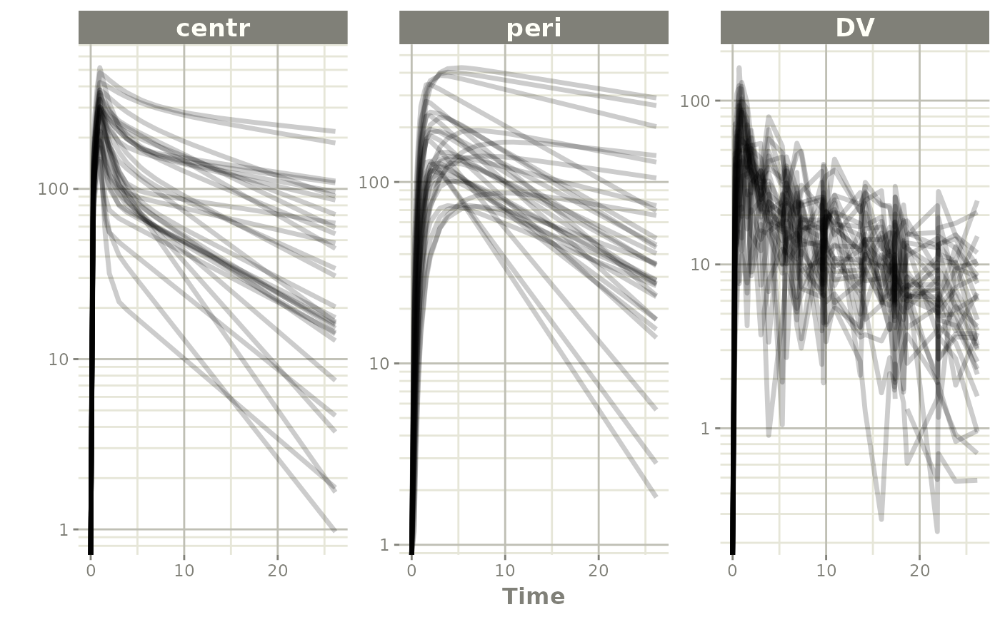

# Weight Based Dosing in rxode2

This is an example model for weight based dosing of daptomycin.
Daptomycin is a cyclic lipopeptide antibiotic from fermented
*Streptomyces roseosporus*.

There are 3 stages for weight-based dosing simulations: - Create rxode2
model - Simulate Covariates - Create event table with weight-based
dosing (merged back to covariates)

## Creating a 2-compartment model in rxode2

``` r
library(rxode2)
```

    #> rxode2 5.0.1 using 2 threads (see ?getRxThreads)
    #>   no cache: create with `rxCreateCache()`

``` r
## Note the time covariate is not included in the simulation
m1 <- function() {
  model({
    CL ~ (1-0.2*SEX)*(0.807+0.00514*(CRCL-91.2))*exp(eta.cl)
    V1 ~ 4.8*exp(eta.v1)
    Q ~ (3.46+0.0593*(WT-75.1))*exp(eta.q);
    V2 ~ 1.93*(3.13+0.0458*(WT-75.1))*exp(eta.v2)
    A1 ~ centr;
    A2 ~ peri;
    d/dt(centr) <- - A1*(CL/V1 + Q/V1) + A2*Q/V2;
    d/dt(peri) <- A1*Q/V1 - A2*Q/V2;
    DV = centr / V1 * (1 + prop.err)
  })
}
```

## Simulating Covariates

This simulation correlates age, sex, and weight. Since we will be using
weight based dosing, this needs to be simulated first

``` r
set.seed(42)
rxSetSeed(42)
library(dplyr)
```

    #> 
    #> Attaching package: 'dplyr'

    #> The following objects are masked from 'package:stats':
    #> 
    #>     filter, lag

    #> The following objects are masked from 'package:base':
    #> 
    #>     intersect, setdiff, setequal, union

``` r
nsub=30
# Simulate Weight based on age and gender
AGE<-round(runif(nsub,min=18,max=70))
SEX<-round(runif(nsub,min=0,max=1))
HTm<-round(rnorm(nsub,176.3,0.17*sqrt(4482)),digits=1)
HTf<-round(rnorm(nsub,162.2,0.16*sqrt(4857)),digits=1)
WTm<-round(exp(3.28+1.92*log(HTm/100))*exp(rnorm(nsub,0,0.14)),digits=1)
WTf<-round(exp(3.49+1.45*log(HTf/100))*exp(rnorm(nsub,0,0.17)),digits=1)
WT<-ifelse(SEX==1,WTf,WTm)
CRCL<-round(runif(nsub,30,140))
## id is in lower case to match the event table
cov.df <- tibble(id=seq_along(AGE), AGE=AGE, SEX=SEX, WT=WT, CRCL=CRCL)
print(cov.df)
```

    #> # A tibble: 30 x 5
    #>       id   AGE   SEX    WT  CRCL
    #>    <int> <dbl> <dbl> <dbl> <dbl>
    #>  1     1    66     1  49.4    83
    #>  2     2    67     1  52.5    79
    #>  3     3    33     0  97.9    37
    #>  4     4    61     1  63.8    66
    #>  5     5    51     0  71.8   127
    #>  6     6    45     1  69.6   132
    #>  7     7    56     0  61      73
    #>  8     8    25     0  57.7    47
    #>  9     9    52     1  58.7    65
    #> 10    10    55     1  73.1    64
    #> # i 20 more rows

## Creating weight based event table

``` r
s<-c(0,0.25,0.5,0.75,1,1.5,seq(2,24,by=1))
s <- lapply(s, function(x){.x <- 0.1 * x; c(x - .x, x + .x)})

e <- et() %>%
    ## Specify the id and weight based dosing from covariate data.frame
    ## This requires rxode2 XXX 
    et(id=cov.df$id, amt=6*cov.df$WT, rate=6 * cov.df$WT) %>%
    ## Sampling is added for each ID
    et(s) %>%
    as.data.frame %>%
    ## Merge the event table with the covarite information
    merge(cov.df, by="id") %>%
    as_tibble


e
```

    #> # A tibble: 900 x 12
    #>       id    low  time   high cmt         amt  rate  evid   AGE   SEX    WT  CRCL
    #>    <int>  <dbl> <dbl>  <dbl> <chr>     <dbl> <dbl> <int> <dbl> <dbl> <dbl> <dbl>
    #>  1     1  0     0      0     (obs)       NA    NA      0    66     1  49.4    83
    #>  2     1 NA     0     NA     (default)  296.  296.     1    66     1  49.4    83
    #>  3     1  0.225 0.247  0.275 (obs)       NA    NA      0    66     1  49.4    83
    #>  4     1  0.45  0.520  0.55  (obs)       NA    NA      0    66     1  49.4    83
    #>  5     1  0.675 0.701  0.825 (obs)       NA    NA      0    66     1  49.4    83
    #>  6     1  0.9   0.948  1.1   (obs)       NA    NA      0    66     1  49.4    83
    #>  7     1  1.35  1.36   1.65  (obs)       NA    NA      0    66     1  49.4    83
    #>  8     1  1.8   1.93   2.2   (obs)       NA    NA      0    66     1  49.4    83
    #>  9     1  2.7   2.95   3.3   (obs)       NA    NA      0    66     1  49.4    83
    #> 10     1  3.6   3.69   4.4   (obs)       NA    NA      0    66     1  49.4    83
    #> # i 890 more rows

## Solving Daptomycin simulation

``` r
data <- rxSolve(m1, e,
             ## Lotri uses lower-triangular matrix rep. for named matrix
             omega=lotri(eta.cl ~ .306, 
                         eta.q ~0.0652,
                         eta.v1 ~.567,
                         eta.v2 ~ .191),
             sigma=lotri(prop.err ~ 0.15),
             addDosing = TRUE, addCov = TRUE)
```

    #> i parameter labels from comments are typically ignored in non-interactive mode

    #> i Need to run with the source intact to parse comments

``` r
print(data)
```

    #> -- Solved rxode2 object --
    #> -- Parameters ($params): --
    #> # A tibble: 30 x 5
    #>    id    eta.cl  eta.v1      eta.q  eta.v2
    #>    <fct>  <dbl>   <dbl>      <dbl>   <dbl>
    #>  1 1      0.343 -1.25   -0.0936    -0.253 
    #>  2 2      0.444 -0.0581  0.187      0.233 
    #>  3 3      0.142  0.203   0.0617     1.03  
    #>  4 4      0.274 -0.733  -0.0000116 -0.321 
    #>  5 5      0.505 -0.104  -0.406     -0.518 
    #>  6 6      0.472  1.48   -0.537      0.210 
    #>  7 7      0.156 -0.0295  0.112     -0.226 
    #>  8 8     -0.747  0.519  -0.347      0.476 
    #>  9 9      0.326 -0.373   0.340      0.470 
    #> 10 10     0.428 -1.28    0.131     -0.0240
    #> # i 20 more rows
    #> -- Initial Conditions ($inits): --
    #> centr  peri 
    #>     0     0 
    #> -- First part of data (object): --
    #> # A tibble: 900 x 12
    #>      id  evid   cmt   amt  rate  time    DV centr  peri   SEX    WT  CRCL
    #>   <int> <int> <int> <dbl> <dbl> <dbl> <dbl> <dbl> <dbl> <dbl> <dbl> <dbl>
    #> 1     1     1     1  296.  296. 0       0     0    0        1  49.4    83
    #> 2     1     0    NA   NA    NA  0       0     0    0        1  49.4    83
    #> 3     1     0    NA   NA    NA  0.247  41.4  58.8  9.50     1  49.4    83
    #> 4     1     0    NA   NA    NA  0.520  31.2 101.  34.5      1  49.4    83
    #> 5     1     0    NA   NA    NA  0.701  70.6 121.  55.5      1  49.4    83
    #> 6     1     0    NA   NA    NA  0.948  83.3 142.  86.7      1  49.4    83
    #> # i 894 more rows

``` r
plot(data, log="y")
```

    #> Warning in transformation$transform(x): NaNs produced

    #> Warning in ggplot2::scale_y_log10(..., breaks = breaks, minor_breaks =
    #> minor_breaks, : log-10 transformation introduced infinite
    #> values.



## Daptomycin Reference

This weight-based simulation is adapted from the Daptomycin article
below:

Dvorchik B, Arbeit RD, Chung J, Liu S, Knebel W, Kastrissios H.
Population pharmacokinetics of daptomycin. Antimicrob Agents Che mother
2004; 48: 2799-2807.
<doi:(10.1128/AAC.48.8.2799-2807.2004>)\[<https://dx.doi.org/10.1128%2FAAC.48.8.2799-2807.2004>\]

This simulation example was made available from the work of Sherwin Sy
with modifications by Matthew Fidler
